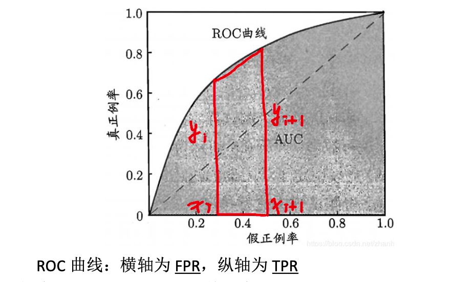
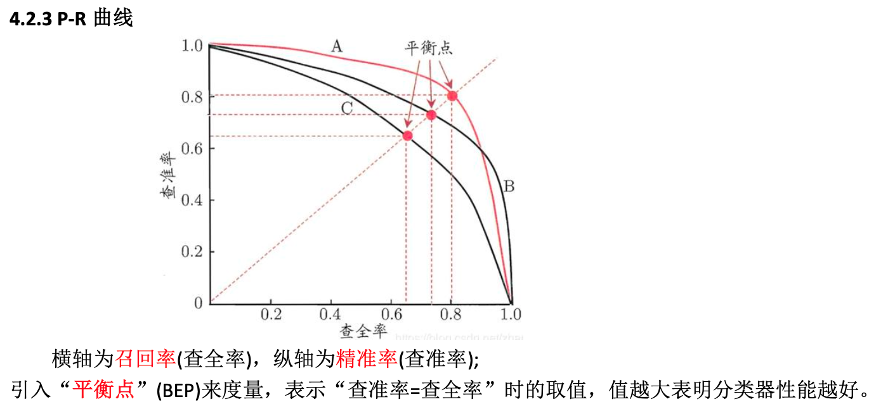

# 机器学习面试

## 一、机器学习模型

### 1.1 监督学习模型

监督学习模型是一类通过从标记的训练数据中学习输入与输出之间的映射关系，以实现对新数据进行准确预测或分类的机器学习模型。这些模型在训练过程中使用包含输入特征和对应标签的数据集，通过调整模型参数来最小化预测误差，从而建立一个能够泛化到未见数据的函数。

####  常见监督学习模型
1. 逻辑回归（Logistic Regression）
    - 原理：逻辑回归是一种广泛用于分类的算法。它通过应用Sigmoid函数，确保输出概率在0到1之间。
    - 代码实现：使用Python的sklearn包可以轻松构建逻辑回归模型。
2. 支持向量机（Support Vector Machine, SVM）
    - 原理：SVM通过寻找一个最优超平面来最大化不同类别之间的间隔，适用于线性和非线性分类问题。
    - 特点：在高维空间中表现良好，能够处理复杂的分类任务。
3. 决策树（Decision Tree）
    - 原理：通过递归地将数据集划分为更小的子集，基于特征值进行判断，最终实现分类或回归。
    - 特点：易于理解和解释，能够处理数值型和类别型数据。
4. 随机森林（Random Forest）
    - 原理：一种集成学习方法，通过构建多个决策树并结合其预测结果来提高模型的准确性和鲁棒性。
    - 特点：减少了单个决策树可能带来的过拟合问题。
5. 神经网络（Neural Networks）
    - 原理：模仿人类大脑的节点层来处理训练数据，适用于复杂的分类和回归问题。
    - 特点：通过多层非线性变换，能够学习到数据中的复杂模式。
####  模型训练与评估
- 训练过程：使用标注数据训练模型，调整模型参数以最小化损失函数。
- 评估方法：使用验证集和测试集评估模型性能，常见的评估指标包括准确率、召回率、F1分数等。

监督学习模型在实际应用中表现出色，但需要注意过拟合和数据标注成本高等挑战。通过合理选择模型和优化策略，可以有效提升模型的性能和泛化能力。


### 1.2 无监督学习模型

无监督学习模型是机器学习的核心分支，旨在从未标记的数据中挖掘隐藏结构、模式或规律。与监督学习不同，它不依赖预先标注的标签，而是通过分析数据本身的特征进行学习，广泛应用于聚类、降维、异常检测等场景。


####  一、核心目标与基本原理

无监督学习的两大核心任务是聚类和降维：

- 聚类：将相似的数据样本自动归为一类，类内相似度高，类间差异大，用于客户分群、行为分析等。
- 降维：在保留关键信息的前提下减少数据维度，解决“维度灾难”，便于可视化和特征提取。

其学习过程依赖于数据的内在结构假设，例如相似性、分布密度或低维流形结构。

####  二、主要模型分类与典型算法

#####  1. 聚类模型

###### （1）K-Means 聚类

- 原理：将数据划分为 K 个簇，每个样本属于距离最近的簇中心（质心），通过迭代优化使簇内平方误差最小。
- 流程：

    1. 随机初始化 K 个质心；
    2. 分配样本到最近质心；
    3. 更新质心为簇均值；
    4. 重复直至收敛。

- 适用场景：用户分群、市场细分。
- 局限：需预设 K 值，对初始质心敏感，难以处理非球形簇。

###### （2）DBSCAN（基于密度的空间聚类）

- 原理：将高密度区域连接成簇，能发现任意形状的聚类，并将稀疏区域识别为噪声。
- 关键参数：邻域半径 ε 和最小点数 MinPts。
- 优势：无需指定簇数量，对噪声鲁棒，适用于地理数据、异常检测等。
- 应用：无线传感器网络中的入侵检测。

###### （3）层次聚类

- 类型：
    - 凝聚型（自底向上）：每个点初始为一簇，逐步合并最相似的簇。
    - 分裂型（自顶向下）：所有点初始为一簇，逐步分割。
- 特点：生成树状图（dendrogram），无需预设簇数，适合分析数据层级结构。

###### （4）高斯混合模型（GMM）

- 原理：假设数据由多个高斯分布混合生成，使用 EM 算法估计参数，实现软聚类（每个样本属于各簇的概率）。
- 优势：提供概率化聚类结果，适用于不确定性建模。

#####  2. 降维模型
###### （1）主成分分析（PCA）
- 原理：线性变换将原始特征投影到方差最大的正交方向（主成分），保留最大信息量。
- 应用：数据压缩、去噪、可视化。
- 局限：仅适用于线性结构。
###### （2）t-SNE（t-分布随机邻域嵌入）
- 原理：非线性降维，保持高维空间中样本间的局部相似性，在低维空间用概率分布建模。
- 优势：非常适合高维数据（如图像、文本）的二维/三维可视化。
- 缺点：计算复杂度高，不适合大规模数据。
###### （3）自编码器（Autoencoder）
- 结构：由编码器（压缩输入）和解码器（重建输入）组成的神经网络。
- 目标：最小化输入与重建输出的误差，学习低维表示（潜在空间）。
- 变体：
  - 稀疏自编码器：引入稀疏性约束，学习更鲁棒的特征。
  - 降噪自编码器：输入加入噪声，提升泛化能力。
- 应用：特征学习、异常检测、图像去噪。
###### （4）等距映射（Isomap）与局部线性嵌入（LLE）
- Isomap：通过测地距离保持全局流形结构，适用于非线性降维。
- LLE：保持局部邻域内的线性关系，适合处理弯曲的低维流形。
---
####  三、深度学习中的无监督模型
随着深度学习发展，无监督学习扩展为以下两类主流方法：
#####  1. 确定型模型：自编码器系列
- 包括标准自编码器、稀疏/降噪/变分自编码器（VAE）。
- 目标是尽可能无损地重建输入，学习紧凑的特征表示。
#####  2. 概率型模型：受限玻尔兹曼机（RBM）与 GAN
- RBM：通过能量函数建模数据概率分布，可用于特征提取和生成模型。
- GAN（生成对抗网络）：由生成器与判别器对抗训练，学习数据分布并生成新样本，广泛用于图像生成。
---
####  四、应用场景
| 领域 | 应用 |
|------|------|
| 电商推荐 | 用户行为聚类，发现潜在消费群体 |
| 医疗诊断 | 对未标注医学影像进行聚类分析，辅助疾病分型 |
| 网络安全 | 无监督入侵检测，识别异常流量模式 |
| 自然语言处理 | 词嵌入（如Word2Vec）、文档主题建模 |
| 数据预处理 | 降维、去噪、特征提取，提升后续模型性能 |
---
####  五、挑战与未来方向
| 挑战 | 说明 |
|------|------|
| 可解释性差 | 聚类结果或潜在表示缺乏语义解释，难以决策支持 |
| 评估困难 | 缺乏统一指标，常用轮廓系数、重建误差等间接评估 |
| 可扩展性问题 | 大规模数据下计算成本高，需优化算法效率 |
| 稳定性不足 | 对噪声和初始参数敏感，结果可能不一致 |
未来方向：
- 开发更鲁棒、可解释的无监督模型；
- 结合自监督学习提升泛化能力；
- 利用分布式计算加速大规模数据处理。

### 1.3 概率模型

概率模型是利用概率论描述系统或数据不确定性的数学框架，广泛应用于统计学、机器学习、人工智能等领域，用于建模随机变量之间的依赖关系、进行推断与预测。


####  一、基本概念与理论基础
#####  1. 概率模型的定义
- 一个概率模型由三部分组成：
    - 样本空间 Ω：所有可能结果的集合；
    - 事件集合：样本空间的子集；
    - 概率函数 P：为每个事件分配一个介于 0 和  1 之间的概率值，满足概率公理。
- 概率模型可以是参数化的（如高斯分布），也可以是非参数化的（如核密度估计）。
#####  2. 频率 vs 概率
- 频率：在重复实验中，事件发生的相对频数；
- 概率：理论上的长期频率，描述事件发生的“可能性”大小。
- 当实验次数足够大时，频率收敛于概率（大数定律）。
#####  3. 条件概率与独立性
- 条件概率：在事件 B 发生的前提下，事件 A 发生的概率，记作 $P(A|B) = \frac{P(A \cap B)}{P(B)}$。
- 事件独立：若 $P(A|B) = P(A)$，则 A 与 B 独立。
- 贝叶斯定理：
  $$
  P(A|B) = \frac{P(B|A)P(A)}{P(B)}
  $$
  是概率推理的核心工具，广泛用于诊断、分类与更新信念。

####  二、核心类型与结构
#####  1. 按建模范式分类
| 类型 | 描述 | 典型模型 |
|------|------|----------|
| 生成模型 | 建模联合概率 $P(X,Y)$，可生成新数据 | 朴素贝叶斯、高斯混合模型（GMM）、隐马尔可夫模型（HMM） |
| 判别模型 | 建模条件概率 $P(Y|X)$，用于分类 | 逻辑回归、支持向量机（SVM）、条件随机场（CRF） |

> ✅ 生成模型能回答更多类型的问题（如“这个样本像什么？”），而判别模型更专注于分类边界。

#####  2. 按结构依赖关系分类
###### （1）概率图模型（PGM）
- 使用图结构表示随机变量间的依赖关系，结点为变量，边为依赖关系。
- 分为两类：
    - 贝叶斯网络（有向图）：表示因果关系，联合概率可分解为条件概率乘积。
    - 马尔可夫随机场（无向图）：表示变量间的相互作用，用势函数描述局部依赖。
###### （2）独立性假设模型
- 如朴素贝叶斯，假设特征之间条件独立，极大简化计算。

####  三、经典模型详解
#####  1. 朴素贝叶斯（Naive Bayes）
- 假设：给定类别下，所有特征相互独立。
- 公式：
  $$
  P(Y|X) \propto P(Y) \prod_{i=1}^n P(X_i|Y)
  $$
- 应用场景：文本分类、垃圾邮件过滤。

#####  2. 高斯混合模型（GMM）
- 原理：数据由多个高斯分布混合生成，每个成分代表一个潜在簇。
- 求解方法：使用 EM 算法迭代优化参数。
- 优势：提供软聚类（概率归属），适用于密度估计与聚类。

#####  3. 隐马尔可夫模型（HMM）
- 适用：序列数据建模（如语音、DNA序列）。
- 结构：隐藏状态序列 + 观测序列，满足马尔可夫性。
- 任务：状态推断、序列生成、参数学习。
#####  4. 贝叶斯网络
- 结构：有向无环图（DAG），节点表示变量，边表示条件依赖。
- 推断：通过变量消除、信念传播等方法计算后验概率。
- 应用：医疗诊断、风险评估等因果推理场景。

####  四、参数估计与学习方法
#####  1. 最大似然估计（MLE）
- 目标：寻找使观测数据出现概率最大的参数 θ。
- 公式：  
  $$
  \hat{\theta}_{\text{MLE}} = \arg\max_\theta P(X|\theta)
  $$
- 示例：估计高斯分布的均值与方差。
#####  2. 贝叶斯估计
- 将参数视为随机变量，引入先验分布 $P(\theta)$，通过贝叶斯定理计算后验：
  $$
  P(\theta|X) = \frac{P(X|\theta)P(\theta)}{P(X)}
  $$
- 优势：可融合先验知识，避免过拟合。
#####  3. EM 算法
- 用于含隐变量的概率模型（如 GMM、HMM）。
- 迭代执行：
    - E步：估计隐变量的期望；
    - M步：最大化期望似然函数。
- 是处理不完整数据的强大工具。

####  五、高级主题与扩展
#####  1. 概率排序原理（信息检索）
- 在检索系统中，概率模型用于估计文档与查询的相关性概率。
- 核心思想：根据先验相关性信息，计算每篇文档的相关概率，并按降序排列。
- 典型算法：BM25，结合词频、逆文档频率与长度归一化。
#####  2. 贝叶斯网络与决策
- 基于贝叶斯决策理论，构建推理网络或信念网络，实现不确定性下的最优决策。
- 应用于推荐系统、风险评估等。
#####  3. 非参数与半参数模型
- 非参数模型：不限制分布形式，如高斯过程、核密度估计；
- 半参数模型：部分参数化，如混合高斯模型 with 自适应成分数量。
- 优势：更灵活，适合复杂数据分布。
#####  4. 蒙特卡罗与变分推断
- 蒙特卡罗方法：通过随机采样近似复杂积分，如 MCMC（马尔可夫链蒙特卡罗）；
- 变分推断：将推断问题转化为优化问题，效率更高，适用于大规模数据。


### 1.4 生成模型和判别模型

生成模型和判别模型是机器学习中两种核心的建模方法，它们在目标、建模对象、应用场景和优缺点上存在显著差异。

####  一、核心概念
1. 生成模型（Generative Models）
    - 定义：生成模型旨在学习数据的联合概率分布 $P(X, Y)$，其中 $X$ 是输入特征，$Y$ 是输出标签。
    - 目标：通过建模数据的生成机制，能够生成新的与训练数据相似的样本。
2. 判别模型（Discriminative Models）
    - 定义：判别模型关注条件概率分布 $P(Y|X)$，即给定输入 $X$ 时输出 $Y$ 的概率。
    - 目标：找到一个决策边界，将不同类别的数据分开，从而对新的输入数据进行分类或预测。
####  二、原理与方法
1. 生成模型
    - 建模方式：学习每个类别下特征的分布 $P(X|Y)$ 和先验概率 $P(Y)$，通过贝叶斯公式计算后验概率 $P(Y|X)$。
    - 典型算法：朴素贝叶斯、隐马尔可夫模型、生成对抗网络（GAN）、变分自编码器（VAE）。
2. 判别模型
    - 建模方式：直接学习输入到输出的映射关系，或条件概率 $P(Y|X)$。
    - 典型算法：逻辑回归、支持向量机（SVM）、决策树、神经网络、k近邻（k-NN）。

####  三、应用场景

1. 生成模型
    - 适用任务：数据生成、图像生成、语音合成、异常检测、半监督学习。
    - 示例：使用GAN生成逼真的图像，或用朴素贝叶斯进行文本分类。
2. 判别模型
    - 适用任务：分类、回归、序列标注、目标检测、语义分割。
    - 示例：用逻辑回归进行垃圾邮件识别，或用CNN进行图像分类。

####  四、优缺点对比

| 特性  | 生成模型  | 判别模型  |
| --- | --- | --- |
| 优点 | 能生成新样本、可处理缺失数据、适合无监督学习、提供完整概率框架 | 分类准确率高、训练效率高、模型简单直接 |
| 缺点 | 计算复杂、对模型假设敏感、可能性能较差 | 无法生成样本、难以处理缺失数据、难以利用无标签数据 |

####  五、关系与转换

- 生成模型可以通过贝叶斯公式转换为判别模型，但反之不成立。
- 两者在某些情况下可以相互配合，如生成对抗网络（GAN）中生成模型和判别模型的对抗训练。

理解生成模型和判别模型的区别，有助于在实际应用中根据任务需求和数据特点选择合适的模型，从而更有效地解决实际问题。


## 二、线性模型

### 2.1 线性回归的损失函数为什么是均方差？

线性回归的损失函数通常选择均方差（Mean Squared Error, MSE）作为优化目标，主要有以下几个原因：

1. **数学性质优良**：
   - 均方差是一个连续且可微的函数，这使得我们可以使用梯度下降等优化算法来高效地求解线性回归模型的参数。
   - MSE 的二阶导数是常数，意味着损失函数是凸的，从而保证了全局最优解的存在。
2. **对误差的敏感性**：
   - 均方差对较大的误差更为敏感，因为误差被平方了。这有助于模型更关注那些预测错误较大的样本，从而提高整体的预测性能。
3. **统计学解释**：
   - 在假设误差服从正态分布的前提下，最小化均方差等价于最大化似然函数。这为线性回归提供了坚实的统计学基础。
4. **易于计算**：
   - 计算均方差相对简单，只需计算预测值与真实值之间的差值平方和的平均值，计算复杂度较低。
5. **广泛的应用**：
   - 均方差作为损失函数在许多机器学习和统计学模型中被广泛采用，具有良好的通用性和适用性。

综上所述，均方差作为线性回归的损失函数，结合了数学上的便利性、对误差的敏感性以及统计学的合理性，使其成为线性回归模型中最常用且有效的选择。

### 2.2 线性回归的正则化

线性回归的正则化是一种通过在损失函数中添加惩罚项来防止模型过拟合的方法。正则化有助于控制模型的复杂度，提高其在未见数据上的泛化能力。常见的正则化方法包括L1正则化（Lasso）和L2正则化（Ridge）。

####  一、L2正则化（Ridge回归）
- **定义**：在普通最小二乘法的损失函数中添加L2范数惩罚项，即参数的平方和。
- **损失函数**：$J(\theta) = \frac{1}{2m} \sum_{i=1}^{m} (h_\theta(x^{(i)}) - y^{(i)})^2 + \lambda \sum_{j=1}^{n} \theta_j^2$ 其中，$\lambda$ 是正则化参数，控制惩罚项的强度。
- **作用**：L2正则化通过惩罚较大的参数值，促使模型参数更小且分布更均匀，从而减少过拟合的风险。
- **特点**：不会将参数完全压缩为零，因此适用于需要保留所有特征的场景。
####  二、L1正则化（Lasso回归）
- **定义**：在损失函数中添加L1范数惩罚项，即参数的绝对值和。
- **损失函数**：$J(\theta) = \frac{1}{2m} \sum_{i=1}^{m} (h_\theta(x^{(i)}) - y^{(i)})^2 + \lambda \sum_{j=1}^{n} |\theta_j|$
- **作用**：L1正则化通过惩罚参数的绝对值，促使一些参数变为零，从而实现特征选择。
- **特点**：适用于高维数据，能够自动选择重要特征，简化模型。
####  三、弹性网正则化（Elastic Net）
- **定义**：结合L1和L2正则化的优点，同时添加两种惩罚项。
- **损失函数**：$J(\theta) = \frac{1}{2m} \sum_{i=1}^{m} (h_\theta(x^{(i)}) - y^{(i)})^2 + \lambda_1 \sum_{j=1}^{n} |\theta_j| + \lambda_2 \sum_{j=1}^{n} \theta_j^2$
- **作用**：弹性网正则化在处理高维数据时表现出色，既能进行特征选择，又能防止过拟。
####  四、选择正则化参数
- 正则化参数 $\lambda$ 的选择对模型性能影响显著。通常通过交叉验证（Cross-Validation）来确定最佳的 $\lambda$ 值。
####  五、总结
- 线性回归的正则化通过在损失函数中添加惩罚项，有效防止过拟合，提高模型的泛化能力。
- L2正则化适用于需要保留所有特征的场景，而L1正则化适用于高维数据，能够实现特征选择。
- 弹性网正则化结合了L1和L2的优点，适用于复杂的高维数据。
- 选择合适的正则化参数是确保模型性能的关键，通常通过交叉验证来实现。

### 2.3 什么是回归？

线性回归（Linear Regression）是一种基础且广泛应用的统计分析方法，用于建模和预测一个连续因变量（目标）与一个或多个自变量（特征）之间的线性关系。其核心思想是通过一条直线（一元线性回归）或一个超平面（多元线性回归）来拟合数据，从而揭示变量间的依赖关系并进行预测。

####  数学上，一元线性回归的模型表达式为：  

$$ y = wx + b $$  

其中 $y$ 是因变量，$x$ 是自变量，$w$ 是权重（斜率），$b$ 是截距。  

####  多元线性回归则扩展为：  

$$ y = w_1x_1 + w_2x_2 + ... + w_nx_n + b $$  

它通过多个特征的线性组合来预测目标值。

####  什么时候使用线性回归？

线性回归适用于满足以下条件的实际问题：

1. 变量间存在线性关系  
    通过散点图或相关性分析可观察到自变量与因变量之间呈近似直线趋势。例如，广告投入与销售额之间的正向关系。
2. 目标是预测连续数值  
    如房价、温度、销售额、体重等可量化指标的预测，而非类别判断。
3. 数据满足基本统计假设  
    - 线性相关：关系可用直线或超平面合理拟合。
    - 误差项独立且服从均值为0的正态分布。
    - 方差齐性（Homoscedasticity）：误差的波动幅度不随自变量变化。
    - 无多重共线性：自变量之间不应高度相关，以免影响系数解释的稳定性。
4. 需要可解释性强的模型  
    线性回归的系数直接反映了每个特征对目标的影响方向和强度，例如“每增加1单位广告投入，销售额平均上升2.5单位”，非常适合用于因果分析和业务洞察。

####  实际应用场景举例
- 经济学：分析收入与消费水平的关系。
- 金融：评估资产回报与市场风险因子之间的线性依赖。
- 医学：研究年龄、体重等指标对血压的影响。
- 工程：预测材料应力随负载变化的趋势。
> ⚠️ 注意：如果数据存在明显的非线性模式或复杂交互效应，线性回归可能欠拟合；此时可考虑多项式回归或非线性模型（如神经网络）作为替代。
总之，当你的数据呈现线性趋势、目标是连续值、且需要一个简单、快速、可解释的模型时，线性回归是一个理想的选择。

### 2.4 什么是梯度下降？SGD 的推导?

梯度下降是一种优化算法，主要用于最小化一个损失函数。通过迭代地调整参数以减少损失函数的值，梯度下降可以帮助我们找到模型的最佳参数配置。最常见的应用场景是训练机器学习模型。

####  梯度下降的基本思想
1. 初始化：随机选择一组初始参数。
2. 计算梯度：对于每个参数，计算损失函数相对于该参数的偏导数（梯度）。
3. 更新参数：沿着负梯度方向更新参数，使得损失函数减小。
4. 重复：重复上述步骤直到达到停止条件（如最大迭代次数、损失函数变化小于某个阈值等）。

####  SGD (Stochastic Gradient Descent) 推导
在标准的梯度下降中，每次更新参数时需要使用整个数据集来计算梯度，这在大数据集上非常耗时。而SGD则是在每次迭代中仅使用一个样本的数据来计算梯度并更新参数，从而加速了收敛过程。

#####  步骤：

1. 初始化：随机选择一组初始参数 \(\theta\)。
2. 遍历所有样本：从训练集中随机选取一个样本 \(x^{(i)}\) 及其对应的标签 \(y^{(i)}\)。
3. 计算损失：计算当前样本的损失 \(L(\theta; x^{(i)}, y^{(i)})\)。
4. 计算梯度：计算损失函数关于参数 \(\theta\) 的梯度 \(\nabla_{\theta} L(\theta; x^{(i)}, y^{(i)})\)。
5. 更新参数：根据学习率 \(\alpha\) 更新参数 \(\theta = \theta - \alpha \cdot \nabla_{\theta} L(\theta; x^{(i)}, y^{(i)})\)。
6. 重复：重复上述步骤直到满足停止条件。

#####  示例代码实现
下面是一个简单的Python代码示例，展示了如何实现线性回归中的SGD：

```python
import numpy as np
生成一些示例数据
np.random.seed(0)
X = 2 * np.random.rand(100, 1)
y = 4 + 3 * X + np.random.randn(100, 1)
添加x0=1到每个实例（用于截距项）
X_b = np.c_[np.ones((100, 1)), X]
初始化参数
theta = np.random.randn(2, 1)
超参数设置
learning_rate = 0.1
n_iterations = 1000
m = len(X_b)
for iteration in range(n_iterations):
    for i in range(m):
        random_index = np.random.randint(m)
        xi = X_b[random_index:random_index+1]
        yi = y[random_index:random_index+1]
        gradients = 2 * xi.T.dot(xi.dot(theta) - yi)
        theta = theta - learning_rate * gradients
print("Theta:", theta)
```

这个代码片段实现了线性回归中的SGD算法，其中`X`和`y`是输入特征和目标变量，`theta`是待优化的参数向量。通过多次迭代和随机选择样本进行梯度更新，最终得到最优的参数估计。


### 2.5 BGD、SGD、MBGD 的区别？

| 对比维度         | BGD（批量梯度下降）                          | SGD（随机梯度下降）                          | MBGD（小批量梯度下降）                        |
|------------------|---------------------------------------------|---------------------------------------------|---------------------------------------------|
| **每次更新使用的样本数** | 所有样本（batch_size = N）                   | 单个样本（batch_size = 1）                   | 小批量样本（batch_size = B，1 < B < N）       |
| **参数更新频率**     | 每遍历完整数据集更新一次                     | 每个样本更新一次                             | 每处理一个小批量更新一次                       |
| **梯度计算准确性**   | 高（基于全量数据，方向稳定）                 | 低（单样本噪声大，方向波动剧烈）             | 中等（批量平均降低噪声，方向较稳定）           |
| **收敛特性**       | 收敛平稳，易达全局最优（凸函数）             | 收敛快但震荡大，易跳过局部最优               | 收敛较快且较稳定，兼顾效率与鲁棒性             |
| **计算开销**       | 高（每次需前向+反向传播全数据）               | 低（单样本计算，资源消耗小）                 | 中等（小批量并行计算，效率较高）               |
| **内存占用**       | 高（需加载全部数据）                         | 低（仅需一个样本）                           | 中等（取决于 batch_size）                     |
| **并行化能力**     | 易于向量化和并行计算                         | 难以并行（串行处理）                         | 易于并行（小批量支持向量化操作）               |
| **典型应用场景**     | 小数据集、精度要求高的任务                   | 大规模数据、在线学习                         | 实际深度学习主流选择（如CNN、Transformer等）   |
| **是否适合GPU加速**  | 适合（但受限于显存）                         | 不适合（无法利用并行性）                     | 最适合（小批量充分发挥GPU并行优势）             |
| **逃离局部最优能力** | 弱（路径稳定，易陷入）                       | 强（噪声大，易跳出）                         | 中等（batch越小，随机性越强）                 |

#####  补充说明

- 本质关系：SGD 和 BGD 可视为 MBGD 在 `batch_size=1` 和 `batch_size=N` 时的特例。
- 实际建议：
    - 数据量 < 1万：可尝试 BGD；
    - 数据量 > 100万或在线学习：推荐 SGD 或 MBGD；
    - 一般深度学习任务：优先选择 MBGD，常用 `batch_size=32~512`，并配合学习率调度策略。

该对比综合了算法原理、性能表现与工程实践，适用于模型训练前的优化策略选择。

### 2.6 常见的损失函数有哪些？

回归任务中常见的损失函数主要包括以下几种：

####  1. 均方误差（MSE, Mean Squared Error）
- 公式：  
  $$
  \text{MSE} = \frac{1}{n} \sum_{i=1}^{n}(y_i - \hat{y}_i)^2
  $$
- 特点：  
    - 对大误差施加更高惩罚（平方项放大偏差），适合误差分布均匀且异常值较少的场景。  
    - 数学性质优良（光滑可导），利于梯度下降等优化算法收敛。  
    - 单位为响应变量单位的平方，解释性较弱（可通过开方转化为RMSE增强可读性）。

####  2. 平均绝对误差（MAE, Mean Absolute Error）
- 公式：  
  $$
  \text{MAE} = \frac{1}{n} \sum_{i=1}^{n}|y_i - \hat{y}_i|
  $$
- 特点：  
    - 误差线性累积，对异常值不敏感，具备鲁棒性。  
    - 在零点不可导，需采用次梯度方法优化。  
    - 单位与响应变量一致，直观反映平均偏差幅度。

####  3. Huber Loss
- 公式（阈值 δ 控制切换点）：  

$$
  L_\delta(y, \hat{y}) = 
  \begin{cases}
  \frac{1}{2}(y - \hat{y})^2 & |y - \hat{y}| \leq \delta  \\
  \delta |y - \hat{y}| - \frac{1}{2}\delta^2 & \text{否则}
  \end{cases}
$$

- 特点：  
    - 小误差区间的平方项保证光滑性，大误差区间的线性项抑制异常值影响。  
    - 需手动设定 δ 参数，增加调参复杂度。

####  4. RMSLE（Root Mean Squared Logarithmic Error）
- 公式：  
  $$
  \text{RMSLE} = \sqrt{ \frac{1}{n} \sum_{i=1}^{n} \left( \log(y_i + 1) - \log(\hat{y}_i + 1) \right)^2 }
  $$
- 特点：  
    - 通过对数转换缩小量纲差异，适用于目标变量跨度大（如房价、销量）的场景。  
    - 隐含假设预测值与真实值同数量级，误差以比例形式体现。
####  5. 平滑L1损失（Smooth L1 Loss）
- 公式： 

$$
  \text{Smooth L1}(x) = 
  \begin{cases}
  0.5x^2 & |x| < 1 \\
  |x| - 0.5 & \text{其他}
  \end{cases}
  \quad (x = y - \hat{y})
$$

- 特点：  
    - 结合L2损失（小误差区）的稳定梯度与L1损失（大误差区）的鲁棒性。  
    - 常用于目标检测中的边界框回归任务。

####  6. 其他损失函数
- 平方误差损失（Squared Error Loss）：单样本误差平方 $ (y - \hat{y})^2 $，是MSE的基础单元。  
- Poisson损失：适用于计数型数据（非负整数），假设响应变量服从泊松分布。  
- 分位数损失：用于构建预测区间，通过指定不同分位点（如0.1、0.9）估计上下界。

####  选择建议

| 场景 | 推荐损失函数 |
|------|--------------|
| 数据干净、无显著异常值 | MSE/RMSE  |
| 存在较多异常值 | MAE 或 Huber Loss  |
| 目标变量跨度大（如价格、流量） | RMSLE  |
| 需平衡收敛速度与鲁棒性 | Smooth L1 或 Huber Loss  |

实际应用中，可结合交叉验证对比不同损失函数下的模型性能（如RMSE、MAE指标），并根据业务需求选择最优方案。

### 2.7 估回归模型的指标?

评估回归模型的性能是机器学习和统计建模中的关键步骤。一个优秀的回归模型不仅要能在训练数据上表现良好，更需要具备良好的泛化能力。为此，研究人员发展出多种评估指标，从不同角度衡量预测值与真实值之间的差异。

以下是常用的回归模型评估指标，结合其数学原理、优缺点及适用场景进行系统详解：


####  1. 均方误差（MSE, Mean Squared Error）
- 公式：

  $$
  \text{MSE} = \frac{1}{n} \sum_{i=1}^{n}(y_i - \hat{y}_i)^2
  $$

- 特点：
    - 对大误差施加更高惩罚（平方项放大偏差），适合误差分布均匀且异常值较少的场景。
    - 数学性质优良（光滑可导），利于梯度下降等优化算法收敛。
    - 单位为响应变量单位的平方，解释性较弱（可通过开方转化为RMSE增强可读性）。
- 适用场景：模型训练、参数优化、对大误差敏感的任务（如金融风险预测）。

####  2. 均方根误差（RMSE, Root Mean Squared Error）
- 公式：

  $$
  \text{RMSE} = \sqrt{\text{MSE}} = \sqrt{\frac{1}{n} \sum_{i=1}^{n}(y_i - \hat{y}_i)^2}
  $$

- 特点：
    - 是 MSE 的平方根，单位与原始数据一致，更易于解释。
    - 保留了 MSE 对大误差敏感的特性，广泛用于需要强调预测精度的场景（如房价预测、销量预估）。
    - 受异常值影响较大，适合数据质量较高的情况。
- 与MSE对比：RMSE 更适合用于报告模型性能，因为它与原始变量同单位，便于理解。

####  3. 平均绝对误差（MAE, Mean Absolute Error）
- 公式：
  $$
  \text{MAE} = \frac{1}{n} \sum_{i=1}^{n}|y_i - \hat{y}_i|
  $$
- 特点：
    - 误差线性累积，对异常值不敏感，具备鲁棒性。
    - 在零点不可导，需采用次梯度方法优化。
    - 单位与响应变量一致，直观反映平均偏差幅度。
- 与MSE对比：当数据中存在较多离群点时，MAE 更稳定；MSE 则更适合追求高精度拟合且数据干净的场景。

####  4. 决定系数（R², R-Squared）
- 公式：

$$
  R^2 = 1 - \frac{\sum(y_i - \hat{y}_i)^2}{\sum(y_i - \bar{y})^2} = 1 - \frac{\text{SS}_{\text{res}}}{\text{SS}_{\text{tot}}}
$$

  其中 $\bar{y}$ 是真实值的均值。
- 特点：
    - 衡量模型对数据变异的解释能力，取值范围通常在 [0, 1]。
    - 越接近 1，说明模型拟合效果越好；接近 0 表示模型几乎无解释力。
    - 不随预测误差的尺度变化而剧烈波动，具有良好的稳定性。
- 注意：R² 会随着特征增加而上升（即使无意义特征），建议配合 调整R²（Adjusted R²） 使用，以惩罚过多变量。

####  5. 平均绝对百分比误差（MAPE, Mean Absolute Percentage Error）
- 公式：

$$
  \text{MAPE} = \frac{1}{n} \sum_{i=1}^{n} \left| \frac{y_i - \hat{y}_i}{y_i} \right| \times 100\%
$$

- 特点：
    - 以百分比形式呈现，便于跨不同量级的数据比较（如销售额从100到10000的产品）。
    - 广泛应用于商业、金融和供应链预测领域。
    - 当真实值 $y_i$ 接近 0 时，MAPE 会趋于无穷大，导致不稳定。
- 改进方案：可使用 SMAPE（Symmetric MAPE）或 WMAPE 来缓解该问题。

####  6. 其他进阶与专用指标

| 指标 | 公式/说明 | 应用场景 |
|------|----------|--------|
| RMSEC | 校准集的RMSE，$\text{RMSEC} = \sqrt{\frac{1}{n}\sum(y - \hat{y})^2}$ | 化学计量、光谱建模等领域 |
| RMSEP | 预测集的RMSE，评估泛化能力 | 模型外部验证 |
| RRMSEC/RRMSEP | 相对误差：$\text{RRMSE} = \frac{\text{RMSE}}{\bar{y}} \times 100\%$ | 跨数据集比较 |
| RPD（Performance to Deviation Ratio） | $\text{RPD} = \frac{\text{SD}}{\text{RMSEP}}$，SD为标准差 | 模型预测能力分级：>2 为良好，>3 为优秀 |
| Explained Variance Score | 类似 R²，但基于方差分解，理想值为1 | 多因素复杂系统建模评估 |

####  7. 指标选择建议（实践指南）

| 场景 | 推荐指标 | 理由 |
|------|----------|------|
| 数据干净、无显著异常值 | ✅ MSE / RMSE | 收敛快，数学性质好，适合优化与评估 |
| 数据含较多噪声或异常值 | ✅ MAE | 更鲁棒，避免模型被异常点带偏 |
| 需强调预测精度，惩罚大误差 | ✅ MSE / RMSE | 如金融风控、物理测量等关键场景 |
| 需直观解释误差大小 | ✅ MAE / MAPE | MAE单位一致，MAPE便于跨量级比较 |
| 评估模型整体拟合优度 | ✅ R² | 综合反映模型解释能力，便于横向对比 |
| 需评估泛化能力 | ✅ RMSEP / RPD | 外部验证集表现更真实 |

####  8. 实践建议与最佳实践
- 组合使用多个指标：  
  不要依赖单一指标。推荐组合使用 RMSE（精度）、MAE（鲁棒性）、R²（拟合度）和 MAPE（相对误差）以全面评估模型。
- 结合交叉验证：  
  使用 K 折交叉验证计算上述指标的均值与标准差，评估模型稳定性与泛化能力。
- 进行残差分析：  
  绘制残差图（residual plot）检查是否存在系统性偏差（如趋势、异方差）。理想情况下，残差应围绕0随机分布。
- 区分损失函数与评估指标：  
  损失函数用于模型训练（如 MSE），而评估指标用于性能度量（如 MAE、R²），二者可不同。

####  总结
> 一个好的回归模型应具备：低 MSE/RMSE/MAE、高 R²、残差随机分布。  
> 指标的选择本质上是偏差与鲁棒性、精度与可解释性之间的权衡。  
> 理解每个指标的数学本质和适用边界，才能在真实业务场景中做出科学决策。

通过合理选用这些指标，并结合可视化分析与交叉验证，可以全面、客观地评估回归模型的性能，为模型优化和决策支持提供可靠依据。

### 2.8 MBGD 需要注意什么?

在使用小批量梯度下降（Mini-Batch Gradient Descent, MBGD）时，有几个关键点需要注意，以确保模型训练的有效性和稳定性：

1. **选择合适的批量大小（Batch Size）**：
    - 批量大小的选择对训练速度和模型性能有显著影响。常见的选择范围是32到512。较小的批量大小可以提供更频繁的参数更新，有助于跳出局部最优，但可能导致训练不稳定；较大的批量大小则能更稳定地估计梯度，但可能需要更多的内存。
    - 经验法则：对于大多数任务，32或64是一个不错的起点，可以根据具体情况进行调整。
2. **学习率（Learning Rate）调整**：
    - 学习率是影响收敛速度和稳定性的关键超参数。过高的学习率可能导致训练发散，而过低的学习率则会使训练过程过慢。
    - 可以使用学习率调度器（如学习率衰减、余弦退火等）来动态调整学习率，或者采用自适应优化算法（如Adam、RMSprop）来自动调整学习率。
3. **数据预处理**：
    - 确保输入数据经过适当的归一化或标准化处理，以避免特征尺度差异过大影响梯度计算。
    - 数据增强（如图像旋转、裁剪等）可以提高模型的泛化能力。
4. **随机打乱数据**：
    - 在每个epoch开始前，随机打乱训练数据，以确保每个小批量样本的多样性，避免模型过拟合某些特定模式。
5. **监控训练过程**：
    - 定期评估模型在验证集上的性能，监控损失和指标的变化，及时调整超参数。
    - 使用早停（Early Stopping）策略，当验证集性能不再提升时，提前终止训练以防止过拟合。
6. **硬件资源管理**：
    - 确保批量大小适合可用的硬件资源（如GPU内存），避免因内存不足导致训练中断。
    - 利用并行计算和分布式训练技术，提高训练效率。
7. **模型保存与恢复**：
    - 定期保存模型检查点（Checkpoints），以便在训练过程中断时能够恢复训练，避免从头开始。
8. **调试与实验记录**：
    - 记录每次实验的超参数设置、训练过程和结果，便于后续分析和复现。
9. **理解梯度噪声**：
    - 由于每个小批量只包含部分数据，梯度估计会存在噪声。这种噪声有时有助于跳出局部最优，但也可能导致训练不稳定。适当调整批量大小和学习率可以缓解这一问题。
10. **结合正则化技术**：
    - 使用正则化方法（如L2正则化、Dropout等）来防止过拟合，特别是在数据量有限的情况下。

通过关注这些关键点，能够更有效地利用小批量梯度下降进行模型训练，提高模型的性能和稳定性。


### 2.9 什么是正态分布？为什么要重视它？

正态分布（Normal Distribution），又称高斯分布（Gaussian Distribution），是统计学中最重要的概率分布之一。它由两个参数决定：均值（μ）和标准差（σ），其概率密度函数呈钟形曲线，对称于均值。

####  正态分布的主要特征

1. 集中趋势：均值、中位数和众数相等，位于分布的中心。
2. 离散程度：标准差决定了分布的宽度，标准差越大，数据越分散。
3. 对称性：分布关于均值对称，左右两侧的面积相等。
4. 68-95-99.7规则：约68%的数据落在均值的一个标准差范围内，约95%的数据落在两个标准差范围内，约99.7%的数据落在三个标准差范围内。

####  为什么要重视正态分布？

1. 自然界和人类社会的普遍性：许多自然现象和社会现象，如身高、体重、考试成绩等，都近似服从正态分布。生产与科学实验中很多随机变量的概率分布都可以近似地用正态分布来描述，例如产品的强力、抗压强度、口径、长度等指标；测量同一物体的误差；弹着点沿某一方向的偏差等。
2. 统计分析的基础：正态分布是许多统计方法和模型的基础，如假设检验、回归分析等。这些方法的有效性和可靠性往往依赖于数据是否符合正态分布。
3. 中心极限定理的支持：该定理指出，在一定条件下，大量独立随机变量的和或平均值会趋向于正态分布，即使这些变量本身并不服从正态分布。这解释了为什么正态分布在实际应用中如此常见。
4. 误差分析的重要工具：在测量和实验中，误差通常被认为是多种微小随机因素共同作用的结果，因此误差的分布往往近似于正态分布。通过正态分布的性质，可以对误差进行有效的分析和控制。

因此，正态分布不仅是理论研究的重要对象，也在实际应用中发挥着关键作用。理解和掌握正态分布的性质，对于数据分析和决策制定具有重要意义。

## 三、逻辑回归

### 3.1 什么是逻辑回归？

逻辑回归（Logistic Regression）是一种广泛应用于分类问题的统计模型，尽管其名称中包含“回归”二字，但它实际上是一种用于预测离散型目标变量（通常是二分类）的判别模型。逻辑回归通过估计输入特征与类别标签之间的关系，来预测样本属于某一类别的概率。

####  逻辑回归的基本原理
逻辑回归的核心思想是将线性回归的输出通过一个非线性函数（通常是逻辑函数或sigmoid函数）映射到0到1之间，从而表示为概率值。具体来说，逻辑回归模型可以表示为：   

$$ P(Y=1|X) = \sigma(w^T X + b) = \frac{1}{1 + e^{-(w^T X + b)}} $$

其中，$P(Y=1|X)$ 表示给定输入特征 $X$ 时，样本属于类别1的概率；$w$ 是权重向量，$b$ 是偏置项；$\sigma(z)$ 是sigmoid函数。

####  逻辑回归的应用场景

1. **二分类问题**：逻辑回归最常用于二分类任务，如垃圾邮件检测、疾病诊断（患病与否）、客户流失预测等。
2. **多分类问题**：通过扩展逻辑回归（如一对多策略），逻辑回归也可以应用于多分类任务。
3. **概率估计**：逻辑回归不仅能进行分类，还能输出样本属于某一类别的概率 ，便于进一步的决策分析。

####  逻辑回归的优点

1. **模型简单易懂**：逻辑回归模型结构简单，参数易于解释，适合初学者理解。
2. **计算效率高**：逻辑回归的训练过程相对较快，适用于大规模数据集。
3. **概率输出**：逻辑回归能够提供类别的概率估计，有助于风险评估和决策制定。
4. **适用于线性可分数据**：当数据线性可分时，逻辑回归表现良好。

####  逻辑回归的局限性

1. **线性假设**：逻辑回归假设特征与类别之间存在线性关系，无法捕捉复杂的非线性模式。
2. **对异常值敏感**：逻辑回归对异常值较为敏感，可能影响模型的稳定性。
3. **特征工程依赖**：逻辑回归对特征的选择和处理较为依赖，需进行适当的特征工程。

### 3.2 逻辑回归的损失函数？

逻辑回归的损失函数通常采用对数损失函数（Log Loss），也称为交叉熵损失函数（Cross-Entropy Loss）。该损失函数用于衡量模型预测的概率分布与真实标签之间的差异，适用于二分类问题。

####  对数损失函数的定义
对于一个二分类问题，假设有 $m$ 个样本，真实标签为 $y^{(i)} \in \{0, 1\}$，模型预测的概率为 $\hat{y}^{(i)} = P(Y=1|X^{(i)})$，则对数损失函数定义为：

$$ J(w, b) = -\frac{1}{m} \sum_{i=1}^{m} \left[ y^{(i)} \log(\hat{y}^{(i)}) + (1 - y^{(i)}) \log(1 - \hat{y}^{(i)}) \right] $$

其中，$w$ 是权重向量，$b$ 是偏置项，$\hat{y}^{(i)}$ 是通过逻辑回归模型计算得到的预测概率。

####  损失函数的解释
- 当真实标签 $y^{(i)} = 1$ 时，损失函数的第一项 $- \log(\hat{y}^{(i)})$ 起作用，此时如果模型预测的概率 $\hat{y}^{(i)}$ 越接近1，损失越小。
- 当真实标签 $y^{(i)} = 0$ 时，损失函数的第二项 $- \log(1 - \hat{y}^{(i)})$ 起作用，此时如果模型预测的概率 $\hat{y}^{(i)}$ 越接近0，损失越小。
- 损失函数的值越小，表示模型的预测越准确。

####  优化目标
逻辑回归的训练目标是通过优化损失函数 $J(w, b)$，找到最佳的参数 $w$ 和 $b$，使得损失函数最小化。常用的优化算法包括梯度下降（Gradient Descent）、随机梯度下降（SGD）和小批量梯度下降（MBGD）。

####  正则化
为了防止过拟合，逻辑回归中常常引入正则化项，常见的有L2正则化（岭回归）和L1正则化（Lasso回归）。引入正则化后的损失函数为：   
$$ J(w, b) = -\frac{1}{m} \sum_{i=1}^{m} \left[ y^{(i)} \log(\hat{y}^{(i)}) + (1 - y^{(i)}) \log(1 - \hat{y}^{(i)}) \right] + \lambda R(w) $$   
其中，$R(w)$ 是正则化项，$\lambda$ 是正则化强度的超参数。
- L2正则化：$R(w) = \frac{1}{2} \sum_{j=1}^{n} w_j^2$
- L1正则化：$R(w) = \sum_{j=1}^{n} |w_j|$   
通过合理选择损失函数和正则化方法，逻辑回归能够有效地进行分类任务，并在实际应用中表现出良好的性能。

### 3.3 为什么 LR 要使用 sigmoid 函数? 

LR（逻辑回归）使用sigmoid函数的核心原因在于其数学特性与分类任务需求的高度契合。以下从多个维度进行专业分析：

####  1. 概率映射与决策边界
Sigmoid函数将任意实数映射到(0,1)区间，完美符合概率解释需求：

- 函数形式：$f(z) = \frac{1}{1+e^{-z}}$
- 当$z \to +\infty$时，$f(z) \to 1$；当$z \to -\infty$时，$f(z) \to 0$
- 输出值可直接解释为事件发生概率

#### 2. 凸优化保证
使用对数损失函数时，sigmoid的复合函数保持凸性：

- 损失函数：$L(w) = -\sum_{i=1}^{n}$
- 凸性保证梯度下降可收敛到全局最优解

#### 3. 导数计算优势
Sigmoid函数具有简洁的导数形式：

- $f'(z) = f(z)(1-f(z))$
- 这种自反式导数结构极大简化了反向传播计算

#### 4. 统计学基础
从广义线性模型视角：

- 逻辑回归假设目标变量服从伯努利分布
- Sigmoid是伯努利分布的规范联系函数(canonical link)
- 自然参数$\eta = \log\frac{\phi}{1-\phi}$与线性预测器直接对应

#### 5. 扩展性优势
- 二分类场景：标准sigmoid函数
- 多分类场景：扩展为softmax函数
- 这种一致性保证了模型架构的统一性

#### 6. 正则化兼容性
- Sigmoid输出的概率值天然满足L1/L2正则化要求
- 在高维稀疏数据场景下仍能保持数值稳定性

需要强调的是，虽然其他函数（如tanh）也能实现非线性映射，但sigmoid函数在概率解释、优化保证和统计基础三方面的综合优势使其成为逻辑回归的最优选择。正如文献[7]指出的，这种选择本质上是最大熵原理的体现，在缺乏先验知识时提供最均匀的概率分布假设。


### 3.4 为什么常常要做特征组合（特征交叉）？

特征组合（Feature Interaction 或 Feature Crossing）是指将原始特征通过某种方式进行组合，生成新的特征，以捕捉特征之间的非线性关系和交互效应。以下从多个角度分析为什么在机器学习中常常需要进行特征组合：
####  1. 捕捉非线性关系
- 许多实际问题中，特征与目标变量之间的关系往往是非线性的。通过特征组合，可以引入非线性关系，使模型能够更好地拟合数据。
- 例如，在房价预测中，房屋面积和位置的交互作用可能对价格有显著影响，单独考虑这两个特征可能无法充分捕捉这种关系。
#### 2. 提升模型表达能力
- 线性模型（如线性回归、逻辑回归）本质上是线性的，无法直接处理复杂的非线性关系。通过特征组合，可以增强模型的表达能力，使其能够拟合更复杂的模式。
- 例如，添加多项式特征（如平方项、交叉项）可以使线性模型具备拟合非线性数据的能力。
#### 3. 增强特征信息
- 原始特征可能包含有限的信息，通过组合特征，可以生成新的、更具信息量的特征，从而提高模型的预测性能。
- 例如，在用户行为分析中，用户的年龄和购买频率的组合可能比单独使用这两个特征更能反映用户的购买倾向。
#### 4. 适应复杂数据结构
- 许多实际数据具有复杂的结构和模式，单一特征可能无法充分描述这些结构。特征组合可以帮助模型更好地理解数据的内在结构。
- 例如，在图像识别中，像素之间的空间关系可以通过特征组合来捕捉，从而提高分类准确率。
#### 5. 提高模型的泛化能力
- 适当的特征组合可以帮助模型更好地泛化到未见数据，减少过拟合风险。
- 通过引入交互特征，模型可以更全面地理解数据的多样性，从而在测试集上表现更好。
#### 6. 实际应用中的成功案例
- 在推荐系统中，特征组合（如用户-物品交互特征）被广泛应用，显著提升了推荐效果。
- 在广告点击率预测中，特征组合（如用户特征与广告特征的交叉）是提升模型性能的关键手段。
- 在自然语言处理任务中，词与词之间的组合（如n-grams）能够捕捉上下文信息，提高文本分类和情感分析的效果。
- 例如，在电子商务推荐系统中，用户的购买历史与浏览行为的交互特征可以显著提升推荐的相关性和准确性。
#### 7. 注意事项
- 特征组合可能导致特征空间维度爆炸，增加计算复杂度和过拟合风险。因此，在进行特征组合时，需要结合领域知识和数据分析，选择合适的组合方式。
- 可以使用正则化技术（如L1正则化）来控制模型复杂度，防止过拟合。
- 结合自动化特征工程工具（如FeatureTools）和特征选择方法（如递归特征消除）可以有效管理特征组合的复杂性。
#### 总结
特征组合是提升机器学习模型性能的重要手段，能够捕捉复杂的非线性关系和交互效应。通过合理设计和选择特征组合，可以显著增强模型的表达能力和泛化能力，从而在实际应用中取得更好的效果。

### 3.5 逻辑回归与线性回归的区别？

逻辑回归（Logistic Regression）和线性回归（Linear Regression）是两种常见的回归分析方法，尽管它们在名称上都包含“回归”二字，但它们的应用场景、模型结构和目标变量类型存在显著差异。以下从多个维度对两者进行详细对比：

| 维度               | 逻辑回归（Logistic Regression）           | 线性回归（Linear Regression）               |
|------------------|---------------------------------------|-----------------------------------------|
| **目标变量类型**     | 离散型（通常为二分类，如0和1）               | 连续型（实数值，如房价、温度等）               |
| **模型输出**       | 预测类别的概率值（0到1之间）               | 预测连续数值                           |
| **假设函数**       | 使用sigmoid函数将线性组合映射到概率空间         | 直接使用线性组合进行预测                     |
| **损失函数**       | 对数损失函数（Log Loss）                     | 均方误差（MSE, Mean Squared Error）         |
| **优化目标**       | 最大化似然函数（最大化正确分类的概率）           | | 最小化预测值与真实值之间的平方误差               |
| **模型解释性**     | 权重系数表示特征对类别概率的影响（对数几率比）       | 权重系数表示特征对目标变量的线性影响           |
| **适用场景**       | 分类任务（如垃圾邮件检测、疾病诊断）               | 回归任务（如房价预测、销售额预测）             |        
| **假设前提**       | 线性可分（特征与类别之间存在线性关系）            | 线性关系（特征与目标变量之间存在线性关系）       |
| **模型复杂度**     | 相对较低，适合小数据集和高维数据               | 相对较低，适合小数据集和高维数据               |
| **正则化**         | 常用L1（Lasso）和L2（Ridge）正则化               | 常用L1（Lasso）和L2（Ridge）正则化               |
| **多分类扩展**     | 可通过一对多（One-vs-Rest）或多项式逻辑回归扩展到多分类 | 可通过多元线性回归处理多个连续目标变量           |     

### 3.6 为什么 LR 比线性回归要好？

逻辑回归（LR）并非绝对优于线性回归，而是因其设计特性更适配分类任务需求。以下是关键差异分析：

####  输出特性与任务适配性
线性回归输出为连续值，需额外设定阈值进行分类，而LR直接输出(0,1)区间概率值，通过0.5阈值即可完成分类。这种概率输出使LR在信用评分、疾病诊断等风险评估场景更具解释性。

####  损失函数与优化机制
线性回归采用均方误差（MSE），对异常值敏感且惩罚无界。LR使用对数损失函数（Log Loss），其惩罚机制随预测偏差增大逐渐收敛，避免过重惩罚错误样本。这种特性使LR在类别不平衡数据中表现更鲁棒。

####  决策边界与非线性处理
LR本质是线性分类器，但通过特征工程可扩展至非线性场景。如文献[8]所述，通过特征离散化或核技巧（如高斯核）可构建非线性决策边界。而线性回归受限于连续输出特性，难以直接处理非线性分类需求。

####  正则化与模型泛化
LR天然支持L1/L2正则化，通过引入拉普拉斯/高斯先验防止过拟合。线性回归虽可添加正则化项，但其最小二乘框架对异常值的敏感性仍会影响泛化性能。

####  应用场景对比

| 场景                | 推荐模型        | 原因                          |
|---------------------|----------------|-----------------------------|
| 房价预测（连续值）   | 线性回归        | 输出需覆盖全实数域            |
| 垃圾邮件识别（二分类）| LR             | 概率输出适配阈值决策          |
| 高维稀疏特征分类      | LR+正则化       | 特征选择能力优于线性回归 |

综上，LR通过概率建模、鲁棒优化和正则化支持，在分类任务中表现优于线性回归。但需注意，对于线性可分的回归问题，线性回归仍是更合适的选择。


### 3.7 LR 参数求解的优化方法？(机器学习中常用的最优化方法)?

逻辑回归（Logistic Regression, LR）参数求解的优化方法主要包括以下几种常用的最优化技术：

####  1. 批量梯度下降（Batch Gradient Descent, BGD）
- 原理：计算整个训练集的梯度，更新参数。
- 优点：梯度估计准确，收敛稳定。
- 缺点：计算量大，适合小数据集。

####  2. 随机梯度下降（Stochastic Gradient Descent, SGD）
- 原理：每次使用一个样本计算梯度，更新参数。
- 优点：计算速度快，适合大数据集。
- 缺点：梯度估计噪声大，收敛不稳定。

####  3. 小批量梯度下降（Mini-Batch Gradient Descent, MBGD）
- 原理：每次使用一小批样本计算梯度，更新参数。
- 优点：兼顾BGD和SGD的优点，计算效率高且收敛较稳定。
- 常用批量大小：32、64、128等。

####  4. 牛顿法（Newton's Method）
- 原理：利用二阶导数（Hessian矩阵）信息进行参数更新。
- 优点：收敛速度快，适合中小规模数据集。
- 缺点：计算Hessian矩阵开销大，内存消耗高。

####  5. 拟牛顿法（Quasi-Newton Methods）
- 原理：近似Hessian矩阵，常用BFGS和L-BFGS算法。
- 优点：收敛速度快，计算开销较低。
- 适用场景：中等规模数据集。

####  6. 共轭梯度法（Conjugate Gradient Method）
- 原理：通过构造共轭方向进行参数更新。
- 优点：适合大规模无约束优化问题。
- 缺点：实现复杂，需调参。

####  7. 自适应优化算法
- Adam（Adaptive Moment Estimation）：结合动量和RMSprop，适合大规模数据和非平稳目标。
- RMSprop：对梯度平方进行指数加权平均，适合处理非平稳目标。
- Adagrad：对每个参数使用不同的学习率，适合稀疏数据。

####  8. 正则化技术
- L1正则化（Lasso）：促进稀疏解，适合特征选择。
- L2正则化（Ridge）：防止过拟合，适合多重共线性。
- 弹性网（Elastic Net）：结合L1和L2正则化，兼顾稀疏性和稳定性。

####  9. 学习率调度
- 固定学习率：简单易实现，但需调参。
- 学习率衰减：逐步降低学习率，防止震荡。
- 自适应学习率：如Adam自动调整学习率。
- 余弦退火：周期性调整学习率，提升收敛效果。

####  10. 早停（Early Stopping）
- 原理：监控验证集性能，当性能不再提升时停止训练。
- 优点：防止过拟合，提高泛化能力。
- 实现：设置耐心值（patience），允许若干次性能不提升后停止。

### 3.8  LR 如何解决低维不可分问题？

逻辑回归（Logistic Regression, LR）在处理低维不可分问题时，通常采用以下几种方法来提升模型的分类能力：

####  1. 特征工程与特征组合
- 通过创建新的特征（如多项式特征、交叉特征）来捕捉非线性关系。
- 例如，将两个特征 $x_1$ 和 $x_2$ 组合成一个新特征 $x_1 \imes x_2$，以增强模型的表达能力。
- 使用领域知识指导特征选择和组合，提升模型的判别能力。
####  2. 使用非线性变换
- 应用非线性变换（如对数、平方根、指数等）对原始特征进行处理，使数据在变换后的空间中更易分离。
- 例如，对特征 $x$ 进行平方变换 $x^2$，可能使得原本线性不可分的数据变得线性可分。
####  3. 核技巧（Kernel Trick）
- 虽然逻辑回归本身不直接支持核方法，但可以通过将数据映射到高维空间来实现类似效果。
- 使用核函数（如多项式核、径向基函数核）将数据映射到更高维度，使得数据在高维空间中变得线性可分。
- 这种方法类似于支持向量机（SVM）中的核技巧。
####  4. 正则化技术
- 引入正则化项（如L1、L2正则化）来防止过拟合，同时提升模型的泛化能力。
- 正则化有助于控制模型复杂度，使其在低维不可分情况下仍能有效学习数据模式。
####  5. 数据增强与采样
- 通过数据增强技术（如旋转、缩放、裁剪等）增加训练样本的多样性，提升模型的鲁棒性。
- 使用过采样（如SMOTE）或欠采样技术平衡类别分布，改善模型在不可分数据上的表现。
####  6. 集成学习
- 结合多个逻辑回归模型（如Bagging、Boosting），通过集成方法提升分类性能。
- 集成学习可以利用多个弱分类器的优势，增强整体模型的判别能力。
####  7. 调整决策阈值
- 通过调整分类阈值（默认0.5）来优化模型在特定应用场景下的性能。
- 根据业务需求（如提高召回率或精确率）灵活调整阈值，改善分类效果。
####  8. 使用其他分类模型
- 在逻辑回归无法有效处理低维不可分问题时，考虑使用其他更复杂的分类模型，如决策树、随机森林、支持向量机（SVM）等。
- 这些模型通常具有更强的非线性建模能力，适合处理复杂的分类任务。


### 3.9  LR 与最大熵模型 MaxEnt 的关系?

逻辑回归（Logistic Regression, LR）与最大熵模型（Maximum Entropy Model, MaxEnt）在本质上是等价的，两者都用于分类任务，尤其是二分类问题。以下从多个维度分析两者的关系：
####  1. 理论基础
- 最大熵原理：MaxEnt基于信息论中的最大熵原理，认为在所有符合已知约束条件的概率分布中，熵最大的分布是最优的选择。这意味着在缺乏额外信息时，应选择最不偏的分布。
- 逻辑回归：LR通过对数几率函数（log-odds）建模，直接估计类别概率。其目标是最大化训练数据的似然函数。
####  2. 数学形式
- MaxEnt模型的概率形式为：
$$ P(Y=y|X) = \frac{e^{w^T f(X,y)}}{\sum_{y'} e^{w^T f(X,y')}} $$
其中，$f(X,y)$ 是特征函数，$w$ 是权重向量。
- 逻辑回归的概率形式为：
$$ P(Y=1|X) = \frac{1}{1 + e^{-(w^T X + b)}} $$
- 通过适当选择特征函数，MaxEnt的形式可以转化为LR的形式。
####  3. 损失函数
- MaxEnt通过最大化对数似然函数来估计参数，损失函数与LR的对数损失函数一致。
- LR的损失函数为对数损失函数（Log Loss），与MaxEnt的目标函数相同。
####  4. 应用场景
- 两者均广泛应用于自然语言处理（NLP）、计算机视觉等领域的分类任务。
- 例如，在文本分类中，MaxEnt和LR都能有效处理高维稀疏特征。
####  5. 优化方法
- 两者常用的优化方法包括梯度下降、拟牛顿法等，优化过程类似。
####  6. 多分类扩展
- MaxEnt天然支持多分类问题，通过归一化处理多个类别的概率。
- LR通过一对多（One-vs-Rest）或多项式逻辑回归扩展到多分类任务。
####  7. 解释性
- 两者的权重参数均可解释为特征对类别概率的影响，通常以对数几率比（log-odds ratio）的形式表示。
####  总结
逻辑回归与最大熵模型在数学形式、损失函数和优化方法上高度一致，实质上是同一模型的不同表述。理解两者的关系有助于深入掌握分类模型的理论基础和应用技巧。


### 3.10 为什么 LR 用交叉熵损失而不是平方损失（MSE）？

逻辑回归（Logistic Regression, LR）使用交叉熵损失函数（Cross-Entropy Loss）而非均方误差（Mean Squared Error, MSE）的主要原因在于两者在处理分类任务时的适用性和数学性质存在显著差异。以下从多个维度进行专业分析：
####  1. 任务类型适配性
- 逻辑回归用于二分类任务，目标变量为离散型（0或1）。交叉熵损失函数专为概率分布之间的差异设计，能够有效衡量模型预测的概率与真实标签之间的差异。
- MSE适用于回归任务，目标变量为连续型。使用MSE处理分类任务时，可能导致模型输出不符合概率分布的要求。
####  2. 概率解释
- 交叉熵损失函数直接与概率输出相关，能够衡量模型预测的概率分布与真实标签的匹配程度。其形式为：
$$ L = -\frac{1}{m} \sum_{i=1}^{m} \left[ y^{(i)} \log(\hat{y}^{(i)}) + (1 - y^{(i)}) \log(1 - \hat{y}^{(i)}) \right] $$
- MSE计算的是预测值与真实值之间的平方差异，其形式为：
$$ L = \frac{1}{m} \sum_{i=1}^{m} (y^{(i)} - \hat{y}^{(i)})^2 $$
- 使用MSE时，模型输出可能不在(0,1)区间内，难以解释为概率。
####  3. 优化性质
- 交叉熵损失函数在逻辑回归中具有良好的凸性，确保梯度下降等优化算法能够收敛到全局最优解。
- MSE在逻辑回归中可能导致非凸优化问题，增加收敛难度和不稳定性。
####  4. 梯度计算
- 交叉熵损失函数的梯度计算简洁且稳定，能够有效指导参数更新。其梯度形式为：
$$ \frac{\partial L}{\partial w} = \frac{1}{m} \sum_{i=1}^{m} (\hat{y}^{(i)} - y^{(i)}) X^{(i)} $$
- MSE的梯度计算可能导致梯度爆炸或消失，影响训练过程的稳定性。
####  5. 数值稳定性
- 交叉熵损失函数在计算过程中通过对数运算，能够有效避免数值溢出问题，尤其是在概率值接近0或1时。
- MSE在处理极端预测值时，可能导致数值不稳定，影响模型训练效果。
####  6. 实际应用效果
- 经验表明，使用交叉熵损失函数的逻辑回归在分类任务中表现优于使用MSE的模型，尤其是在处理不平衡数据集时。
- 交叉熵损失函数能够更好地捕捉类别间的差异，提高模型的分类准确率。


### 3.11  LR 能否解决非线性分类问题？

逻辑回归（Logistic Regression, LR）本质上是一个线性分类器，适用于线性可分的数据。然而，通过一些技术手段，LR也可以在一定程度上处理非线性分类问题。以下是几种常见的方法：
####  1. 特征工程与特征组合
- 通过创建新的特征（如多项式特征、交叉特征）来捕捉非线性关系。
- 例如，将两个特征 $x_1$ 和 $x_2$ 组合成一个新特征 $x_1 \imes x_2$，以增强模型的表达能力。
- 使用领域知识指导特征选择和组合，提升模型的判别能力。
####  2. 使用非线性变换
- 应用非线性变换（如对数、平方根、指数等）对原始特征进行处理，使数据在变换后的空间中更易分离。
- 例如，对特征 $x$ 进行平方变换 $x^2$，可能使得原本线性不可分的数据变得线性可分。
####  3. 核技巧（Kernel Trick）
- 虽然逻辑回归本身不直接支持核方法，但可以通过将数据映射到高维空间来实现类似效果。
- 使用核函数（如多项式核、径向基函数核）将数据映射到更高维度，使得数据在高维空间中变得线性可分。
- 这种方法类似于支持向量机（SVM）中的核技巧。
####  4. 正则化技术
- 引入正则化项（如L1、L2正则化）来防止过拟合，同时提升模型的泛化能力。
- 正则化有助于控制模型复杂度，使其在非线性分类问题中仍能有效学习数据模式。
####  5. 数据增强与采样
- 通过数据增强技术（如旋转、缩放、裁剪等）增加训练样本的多样性，提升模型的鲁棒性。
- 使用过采样（如SMOTE）或欠采样技术平衡类别分布，改善模型在非线性数据上的表现。
####  6. 集成学习
- 结合多个逻辑回归模型（如Bagging、Boosting），通过集成方法提升分类性能。
- 集成学习可以利用多个弱分类器的优势，增强整体模型的判别能力。
####  7. 调整决策阈值
- 通过调整分类阈值（默认0.5）来优化模型在特定应用场景下的性能。
- 根据业务需求（如提高召回率或精确率）灵活调整阈值，改善分类效果。
####  8. 使用其他分类模型
- 在逻辑回归无法有效处理非线性分类问题时，考虑使用其他更复杂的分类模型，如决策树、随机森林、支持向量机（SVM）等。
- 这些模型通常具有更强的非线性建模能力，适合处理复杂的分类任务。


### 3.12 用什么来评估 LR 模型？

评估逻辑回归（Logistic Regression, LR）模型的性能通常使用多种指标，具体选择取决于任务的性质（如二分类、多分类）和业务需求。以下是常用的评估指标：
####  1. 准确率（Accuracy）
- 定义：正确预测的样本数占总样本数的比例。
- 适用场景：适用于类别分布均衡的二分类问题。
- 计算公式：$ \text{Accuracy} = \frac{TP + TN}{TP + TN + FP + FN} $
####  2. 精确率（Precision）
- 定义：被预测为正类的样本中实际为正类的比例。
- 适用场景：关注假阳性（FP）时，如垃圾邮件检测。
- 计算公式：$ \text{Precision} = \frac{TP}{TP + FP} $
####  3. 召回率（Recall）
- 定义：实际为正类的样本中被正确预测为正类的比例。
- 适用场景：关注假阴性（FN）时，如疾病诊断。
- 计算公式：$ \text{Recall} = \frac{TP}{TP + FN} $
####  4. F1分数（F1 Score）
- 定义：精确率和召回率的调和平均数。
- 适用场景：在精确率和召回率之间需要权衡时。
- 计算公式：$ \text{F1 Score} = 2 \times \frac{\text{Precision} \times \text{Recall}}{\text{Precision} + \text{Recall}} $
####  5. ROC曲线与AUC值
- ROC曲线：绘制真正率（TPR）与假正率（FPR）之间的关系。
- AUC值：ROC曲线下的面积，衡量模型区分正负样本的能力。
- 适用场景：适用于类别不平衡的二分类问题。
####  6. 对数损失（Log Loss）
- 定义：衡量模型预测概率与真实标签之间的差异。
- 适用场景：适用于需要概率输出的分类任务。
- 计算公式：$ \text{Log Loss} = -\frac{1}{m} \sum_{i=1}^{m} \left[ y^{(i)} \log(\hat{y}^{(i)}) + (1 - y^{(i)}) \log(1 - \hat{y}^{(i)}) \right] $
####  7. 混淆矩阵（Confusion Matrix）
- 定义：展示模型预测结果的矩阵，包含TP、TN、FP、FN四个部分。
- 适用场景：全面了解模型在各类别上的表现。
####  8. Kappa系数
- 定义：衡量分类器预测结果与随机猜测结果的一致性。
- 适用场景：适用于多分类问题，考虑类别不平衡。
####  9. 平均绝对误差（Mean Absolute Error, MAE）
- 定义：预测值与真实值之间绝对误差的平均值。
- 适用场景：适用于需要评估概率预测误差的任务。
- 计算公式：$ \text{MAE} = \frac{1}{m} \sum_{i=1}^{m} |y^{(i)} - \hat{y}^{(i)}| $
####  10. Brier分数
- 定义：衡量概率预测的准确性，值越小表示预测越好。
- 适用场景：适用于概率预测任务。
- 计算公式：$ \text{Brier Score} = \frac{1}{m} \sum_{i=1}^{m} (y^{(i)} - \hat{y}^{(i)})^2 $
####  总结
选择合适的评估指标应根据具体任务需求和数据特性进行。例如，在类别不平衡的二分类任务中，AUC和F1分数通常比准确率更具参考价值。综合使用多种指标可以全面评估逻辑回归模型的性能，指导模型优化和改进。

### 3.13 LR 如何解决多分类问题？（OvR vs OvO）?

逻辑回归（Logistic Regression, LR）本质上是一个二分类模型，但可以通过一些策略扩展到多分类问题。常用的两种方法是一对多（One-vs-Rest, OvR）和一对一（One-vs-One, OvO）。以下是对这两种方法的详细解释：
####  1. 一对多（One-vs-Rest, OvR）
- 原理：对于每个类别，训练一个二分类逻辑回归模型，将该类别作为正类，其他所有类别作为负类。
- 训练过程：如果有 $K$ 个类别，则需要训练 $K$ 个二分类模型。
- 预测过程：对于一个新的样本，计算每个模型的预测概率，选择概率最大的类别作为最终预测结果。
- 优点：实现简单，计算效率较高，适合类别数量较多的情况。
- 缺点：可能存在类别不平衡问题，且各模型之间相互独立，无法捕捉类别间的关系。
####  2. 一对一（One-vs-One, OvO）
- 原理：对于每对类别，训练一个二分类逻辑回归模型，只考虑这两个类别的数据。
- 训练过程：如果有 $K$ 个类别，则需要训练 $\frac{K(K-1)}{2}$ 个二分类模型。
- 预测过程：对于一个新的样本，所有模型进行预测，采用投票机制决定最终类别，得票最多的类别为最终预测结果。
- 优点：每个模型只需处理两个类别的数据，减少了类别不平衡问题，能够更好地捕捉类别间的关系。
- 缺点：计算量大，训练时间较长，适合类别数量较少的情况。
####  3. 选择方法的考虑因素
- 类别数量：当类别数量较多时，OvR通常更高效；当类别数量较少时，OvO可能更准确。
- 计算资源：OvO需要更多的计算资源和时间，适合有充足计算能力的场景。
- 任务需求：根据具体任务对准确率、召回率等指标的要求选择合适的方法。
####  4. 其他多分类方法
- 多项式逻辑回归（Multinomial Logistic Regression）：直接扩展逻辑回归模型，使用softmax函数处理多类别输出。
- 神经网络：通过多层感知器（MLP）等深度学习模型处理复杂的多分类任务。
- 决策树和随机森林：这些模型天然支持多分类任务，适合处理非线性关系。
####  总结
逻辑回归通过一对多（OvR）和一对一（OvO）两种策略有效扩展到多分类问题。选择合适的方法应根据类别数量、计算资源和任务需求进行权衡。此外，结合其他多分类模型可以进一步提升分类性能。

### 3.14 在训练的过程当中，如果有很多的特征高度相关或者说有一个特征重复了 100 遍， 会造成怎样的影响？

在逻辑回归训练过程中，若存在大量高度相关特征或单个特征重复100遍，会产生以下影响：

####  1. 模型收敛性
- 最终分类效果不变：在损失函数收敛的前提下，高度相关的特征组合不会影响模型的整体分类性能。
- 参数未真正收敛：虽然损失函数收敛，但相关特征的参数可能未收敛到稳定值，这会降低训练效率。

#### 2. 参数分配机制
- 权重均分现象：假设原始特征权重为 $w$，重复100次后，每个特征的权重将趋近于 $w/100$。
- 随机采样下的等效性：在随机梯度下降中，这100个特征的整体效应与原始单个特征等效，但可能出现权重正负相消的情况。

#### 3. 训练效率
- 计算资源浪费：特征数量增加100倍，导致每次参数更新的计算量显著增加。
- 训练速度下降：冗余特征会拉低整体训练速度，即使最终分类效果不受影响。

#### 4. 模型可解释性
- 权重分散：原本集中在单一特征的权重被分散到多个相关特征上，难以识别关键特征。
- 业务解释困难：高度相关的特征使模型决策逻辑变得模糊，不利于业务洞察。

#### 5. 去除高度相关特征的好处
- 提升可解释性：减少冗余特征后，模型权重更能反映特征的真实重要性。
- 加速训练：减少特征数量可显著提高训练速度，降低计算成本。


### 3.15 为什么在训练的过程当中将高度相关的特征去掉？

在训练过程中去除高度相关特征的主要原因包括：

####  1. 提升模型可解释性
高度相关的特征会导致权重分配不均，使模型决策逻辑模糊。去除冗余特征后，各特征的权重更能反映其真实重要性，增强模型的可解释性。

#### 2. 提高训练效率
冗余特征会增加计算负担：

- 参数更新时需处理更多维度
- 收敛速度显著降低

去除相关特征可减少计算量，加快训练过程。

#### 3. 降低过拟合风险
高度相关特征可能放大噪声影响，使模型过度拟合训练数据中的随机波动。去除冗余特征有助于提升模型泛化能力。

#### 4. 保证参数稳定性
虽然损失函数可能收敛，但相关特征的参数往往不稳定。去除冗余特征可确保参数真正收敛到稳定值。

#### 5. 优化特征工程
去除冗余特征为引入更有意义的新特征腾出空间，有利于特征工程优化。如文献所述，特征离散化后可引入非线性关系，提升模型表达能力。
注意：虽然去除高度相关特征可能略微影响分类效果，但通常利大于弊。在实际操作中，可通过方差膨胀因子（VIF）或相关系数矩阵识别并去除冗余特征。

### 3.16 逻辑回归中正则化的作用？L1 正则化和 L2 正则化的区别？

逻辑回归中的正则化主要用于防止过拟合，提高模型的泛化能力。通过在损失函数中引入正则化项，可以控制模型的复杂度，避免模型对训练数据的过度拟合。以下是正则化的作用及L1和L2正则化的区别：
####  正则化的作用
1. 防止过拟合：通过限制模型参数的大小，减少模型对训练数据的过度拟合。
2. 提高泛化能力：正则化有助于提升模型在未见数据上的表现。
3. 控制模型复杂度：通过正则化项，限制参数空间，避免模型过于复杂。
4. 促进特征选择：某些正则化方法（如L1正则化）可以促使部分参数变为零，实现特征选择。
####  L1正则化（Lasso）
- 定义：在损失函数中加入参数绝对值的和作为正则化项。
- 数学形式：$ L = -\frac{1}{m} \sum_{i=1}^{m} \left[ y^{(i)} \log(\hat{y}^{(i)}) + (1 - y^{(i)}) \log(1 - \hat{y}^{(i)}) \right] + \lambda \sum_{j=1}^{n} |w_j| $
- 作用：促使部分参数变为零，实现特征选择，适用于高维稀疏数据。
- 优点：模型更简洁，易于解释。
- 缺点：在某些情况下可能导致模型不稳定。
####  L2正则化（Ridge）
- 定义：在损失函数中加入参数平方和作为正则化项。
- 数学形式：$ L = -\frac{1}{m} \sum_{i=1}^{m} \left[ y^{(i)} \log(\hat{y}^{(i)}) + (1 - y^{(i)}) \log(1 - \hat{y}^{(i)}) \right] + \lambda \sum_{j=1}^{n} w_j^2 $
- 作用：缩小参数值，防止过拟合，适用于多重共线性问题。
- 优点：模型稳定，参数不会变为零。
- 缺点：无法实现特征选择，模型可能较复杂。
####  总结
- L1正则化适用于需要特征选择的场景，能够生成稀疏模型。
- L2正则化适用于需要稳定参数估计的场景，能够防止过拟合但不进行特征选择。
- 在实际应用中，可以根据具体任务需求选择合适的正则化方法，或结合两者（弹性网正则化）以获得更好的效果。

## 四、验证方式

### 4.1 什么是过拟合？产生过拟合原因?

过拟合（Overfitting）是指模型在训练数据上表现良好，但在未见数据（如验证集或测试集）上表现较差的现象。换句话说，模型过度学习了训练数据中的噪声和细节，导致其泛化能力下降。
####  产生过拟合的原因
1. 模型复杂度过高：使用过于复杂的模型（如深层神经网络、大量参数的模型）容易捕捉训练数据中的噪声。
2. 训练数据量不足：数据量过少时，模型容易记忆训练样本，无法学习到数据的真实分布。
3. 特征过多：高维特征空间可能导致模型在训练数据上表现良好，但在新数据上泛化能力差。
4. 噪声数据：训练数据中存在大量噪声或异常值，模型可能会过度拟合这些噪声。
5. 训练时间过长：过度训练模型，导致其对训练数据的细节过度敏感。
6. 缺乏正则化：未使用正则化技术，导致模型参数过大，增加过拟合风险。
### 4.2 如何解决过拟合问题？
解决过拟合问题的方法包括：
1. 增加训练数据量：更多的数据有助于模型学习到更一般化的模式。
2. 简化模型：选择更简单的模型或减少模型参数，降低模型复杂度。
3. 特征选择：去除冗余或不相关的特征，减少特征空间维度。
4. 使用正则化：引入L1或L2正则化，限制模型参数的大小。
5. 交叉验证：使用交叉验证技术评估模型性能，选择最佳模型。
6. 提前停止（Early Stopping）：在验证集性能不再提升时停止训练，防止过度训练。
7. 数据增强：通过数据增强技术增加训练样本的多样性，提升模型的鲁棒性。
8. 集成学习：结合多个模型（如Bagging、Boosting）提升整体泛化能力。
9. 使用Dropout：在神经网络中使用Dropout技术，随机丢弃部分神经元，防止过拟合。
10. 调整超参数：通过调节学习率、批量大小等超参数，优化模型训练过程。
### 4.3 什么是欠拟合？产生欠拟合原因?
欠拟合（Underfitting）是指模型在训练数据上表现不佳，无法捕捉数据的基本模式，导致在训练集和测试集上都表现较差的现象。换句话说，模型过于简单，无法充分学习训练数据中的信息。
####  产生欠拟合的原因
1. 模型复杂度过低：使用过于简单的模型（如线性模型）无法捕捉数据中的复杂关系。
2. 特征不足：缺乏关键特征，导致模型无法学习到数据的真实分布。
3. 训练时间不足：模型训练时间过短，未能充分学习训练数据。
4. 过度正则化：正则化参数过大，限制了模型的表达能力。
5. 数据质量差：训练数据中存在大量噪声或错误，影响模型学习。
### 4.4 如何解决欠拟合问题？
解决欠拟合问题的方法包括：
1. 增加模型复杂度：选择更复杂的模型或增加模型参数，提升模型的表达能力。
2. 增加特征：引入更多相关特征，丰富模型的输入信息。
3. 延长训练时间：增加训练轮数，确保模型充分学习训练数据。
4. 减少正则化：降低正则化参数，允许模型有更大的自由度。
5. 提高数据质量：清洗数据，去除噪声和错误，提升训练数据的质量。
6. 使用更复杂的算法：尝试使用更先进的算法（如深度学习）处理复杂任务。
7. 调整超参数：通过调节学习率、批量大小等超参数，优化模型训练过程。
8. 交叉验证：使用交叉验证技术评估模型性能，选择最佳模型。
9. 数据增强：通过数据增强技术增加训练样本的多样性，提升模型的鲁棒性。
10. 集成学习：结合多个模型（如Bagging、Boosting）提升整体泛化能力。

### 4.5 什么是交叉验证？交叉验证的作用是什么？

交叉验证是一种用于评估机器学习模型性能的重采样方法，其核心思想是通过将数据集划分为多个子集，轮流使用其中一部分作为验证集，其余部分作为训练集，从而多次训练和验证模型，以获得更可靠、稳定的性能评估结果。

####  基本原理
- 将原始数据集划分为 $k$ 个大小相似的子集（称为“折”）。
- 每次选择一个子集作为验证集，其余 $k-1$ 个子集作为训练集。
- 重复该过程 $k$ 次，确保每个子集都被用作一次验证集。
- 最终将 $k$ 次验证结果的平均值作为模型性能的评估指标。

#### 主要作用
1. 评估模型性能  
    通过在不同数据子集上进行训练和验证，更全面地评估模型的泛化能力，避免因数据集划分的随机性导致的评估偏差。
2. 防止过拟合和欠拟合  
    交叉验证能够检测模型是否过度拟合训练数据或未能充分学习数据特征，从而帮助优化模型 complexity。
3. 模型选择和参数调优  
    用于比较不同模型或同一模型在不同参数设置下的性能，选择在验证集上表现最佳的模型或参数组合。
4. 提高模型可靠性  
    通过多次训练和验证，确保模型在各种数据分布下都能保持稳定的性能。

#### 常见的交叉验证方法

1. K折交叉验证（K-fold Cross-Validation）  

    将数据集分为 $k$ 个子集，进行 $k$ 次训练和验证，每次使用一个子集作为验证集，其余作为训练集，最终取 $k$ 次结果的平均值。

2. 留一交叉验证（Leave-One-Out Cross-Validation, LOOCV）  

    每次仅留出一个样本作为验证集，其余样本用于训练，进行 $n$ 次训练和验证（$n$ 为样本数量），适用于小数据集。

3. 分层K折交叉验证（Stratified K-fold）  

    确保每个折中保持原始数据集的类别分布，特别适用于不平衡数据集。

4. 时间序列交叉验证（Time Series Cross-Validation）  

    专为时间序列数据设计，按时间顺序划分数据，用早期数据训练，后期数据验证，保持时间依赖性。

5. 重复学习-测试交叉验证（Repeated Learning-Testing）  

    随机划分数据为训练集和测试集，多次重复该过程，常用于数据集较大时。

6. 组K折交叉验证（Group K-fold）  

    确保同一组的数据不会同时出现在训练集和测试集中，防止数据泄漏，适用于具有自然分组结构的数据。

综上，交叉验证是机器学习中不可或缺的模型评估工具，能够有效提升模型的泛化能力和可靠性。


### 4.6 如何在 K 折交叉验证中选择 K？

选择 K 值时需权衡以下因素：

1. 数据集大小  
    - 小数据集：选择较大的 K 值（如 10 或更高），以充分利用数据进行训练和验证。  
    - 大数据集：选择较小的 K 值（如 5），以减少计算开销。
2. 计算资源  
    - K 值越大，训练和验证次数越多，计算开销越大。根据可用计算资源选择合适的 K 值。
3. 模型稳定性  
    - 较大的 K 值通常能提供更稳定的性能估计，但计算成本较高。  
    - 较小的 K 值计算效率高，但可能导致性能估计不稳定。
4. 类别分布  
    - 对于类别不平衡的数据集，使用分层 K 折交叉验证（Stratified K-fold）确保每个折中类别分布一致。
5. 经验法则  
    - 常用的 K 值为 5 或 10，在大多数情况下能取得良好平衡。
6. 任务需求  
    - 根据具体任务对模型性能的要求选择 K 值，如需更精确的性能估计可选择较大的 K 值。
7. 交叉验证变体  
    - 对于时间序列数据，选择适合时间依赖性的交叉验证方法。
8. 试验与调整  
    - 可尝试不同 K 值，观察模型性能变化，选择表现最佳的 K 值。
综上，选择 K 值需综合考虑数据集大小、计算资源、模型稳定性和任务需求，常用的 K 值为 5 或 10。


### 4.7 网格搜索（GridSearchCV）


网格搜索（GridSearchCV）是一种用于超参数优化的系统化方法，通过穷举所有可能的超参数组合，结合交叉验证评估模型性能，从而选择最佳的超参数配置。以下是对网格搜索的详细解释：
####  基本原理
- 定义超参数空间：确定需要调节的超参数及其可能取值范围。
- 构建参数网格：生成所有可能的超参数组合，形成一个参数网格。
- 交叉验证评估：对于每个超参数组合，使用交叉验证评估模型性能，计算平均性能指标（如准确率、F1分数等）。
- 选择最佳组合：根据评估结果，选择性能最优的超参数组合。
####  主要步骤
1. 定义模型和超参数：选择需要优化的模型（如逻辑回归、决策树等）及其超参数。
2. 创建参数网格：使用字典或列表形式定义超参数及其取值范围。
3. 实例化GridSearchCV：指定模型、参数网格、交叉验证折数和性能指标。
4. 训练模型：调用fit方法进行训练和超参数搜索。
5. 获取最佳参数：通过best_params_属性获取最佳超参数组合。
6. 评估模型：使用最佳参数重新训练模型，并在测试集上评估性能。
####  优点
- 系统化搜索：穷举所有可能的超参数组合，确保找到全局最优解。
- 结合交叉验证：通过交叉验证评估模型性能，提升评估的可靠性。
- 易于实现：大多数机器学习库（如Scikit-learn）提供了现成的GridSearchCV实现，使用方便。
####  缺点
- 计算开销大：对于超参数空间较大或模型复杂的情况，计算时间和资源消耗较高。
- 可能过拟合：在小数据集上，过度调节超参数可能导致模型过拟合训练数据。
- 不适用于连续超参数：对于连续超参数，网格搜索可能无法覆盖所有可能值。
####  应用场景
- 超参数调优：在模型训练前，通过网格搜索优化超参数，提高模型性能。
- 模型选择：比较不同模型的性能，选择最适合特定任务的模型。
- 复杂模型优化：对于复杂模型（如深度学习），通过网格搜索找到最佳超参数配置。
####  总结
网格搜索（GridSearchCV）是一种有效的超参数优化方法，通过系统化搜索和交叉验证评估，帮助选择最佳超参数组合。尽管计算开销较大，但其在提升模型性能和可靠性方面具有显著优势。

### 4.8 随机搜索（RandomizedSearchCV）

随机搜索（RandomizedSearchCV）是一种用于超参数优化的高效方法，通过在预定义的超参数空间中随机采样一定数量的超参数组合，结合交叉验证评估模型性能，从而选择最佳的超参数配置。以下是对随机搜索的详细解释：
####  基本原理
- 定义超参数空间：确定需要调节的超参数及其可能取值范围。
- 随机采样：从超参数空间中随机选择一定数量的超参数组合。
- 交叉验证评估：对于每个随机选择的超参数组合，使用交叉验证评估模型性能，计算平均性能指标（如准确率、F1分数等）。
- 选择最佳组合：根据评估结果，选择性能最优的超参数组合。
####  主要步骤
1. 定义模型和超参数：选择需要优化的模型（如逻辑回归、决策树等）及其超参数。
2. 创建参数分布：使用字典或列表形式定义超参数及其取值范围，支持离散和连续分布。
3. 实例化RandomizedSearchCV：指定模型、参数分布、采样次数、交叉验证折数和性能指标。
4. 训练模型：调用fit方法进行训练和超参数搜索。
5. 获取最佳参数：通过best_params_属性获取最佳超参数组合。
6. 评估模型：使用最佳参数重新训练模型，并在测试集上评估性能。
####  优点
- 计算效率高：通过随机采样减少了需要评估的超参数组合数量，适合大规模超参数空间。
- 灵活性强：支持连续和离散超参数，适应不同类型的超参数优化需求。
- 结合交叉验证：通过交叉验证评估模型性能，提升评估的可靠性。
####  缺点
- 可能错过最优解：由于随机采样，可能无法覆盖所有可能的超参数组合，存在错过全局最优解的风险。
- 评估结果不稳定：不同的随机采样可能导致不同的最佳超参数组合，结果具有一定的随机性。
####  应用场景
- 大规模超参数优化：在超参数空间较大或复杂的情况下，随机搜索能够高效找到较优解。
- 资源受限场景：当计算资源有限时，随机搜索能够在较短时间内提供合理的超参数配置。
- 初步调优：作为网格搜索的补充，快速筛选出潜在的超参数组合。
####  总结
随机搜索（RandomizedSearchCV）是一种高效的超参数优化方法，通过随机采样和交叉验证评估，帮助选择最佳超参数组合。尽管存在错过最优解的风险，但其在计算效率和灵活性方面具有显著优势，适用于大规模和复杂的超参数优化任务。

## 五、模型部署与监控

### 5.1 什么是模型部署？
模型部署是将训练好的机器学习模型集成到生产环境中，使其能够处理实际业务数据并提供预测服务的过程。部署后的模型可以通过API、微服务或
嵌入式系统等方式与其他应用程序进行交互，实现自动化决策和智能化服务。
### 5.2 模型部署的常见方式？
模型部署的常见方式包括：
1. RESTful API
   - 通过构建RESTful API接口，使模型能够通过HTTP请求进行访问和调用。
   - 适用于需要与前端应用或其他服务进行交互的场景。
2. 微服务架构
   - 将模型封装为独立的微服务，便于扩展和维护。
   - 适用于复杂系统中多个模型协同工作的场景。
3. 容器化部署
   - 使用Docker等容器技术，将模型及其依赖环境打包，确保一致性和可移植性。
   - 适用于跨平台部署和快速迭代的场景。
4. 云服务平台
   - 利用AWS、Azure、Google Cloud等云服务提供的机器学习部署服务。
   - 适用于需要弹性扩展和高可用性的场景。
5. 嵌入式系统
   - 将模型部署到边缘设备或嵌入式系统中，实现本地化推理。
   - 适用于对延迟敏感或网络连接受限的场景。
6. 批处理系统
   - 将模型集成到批处理系统中，定期处理大规模数据并生成预测结果。
   - 适用于离线分析和报表生成的场景。
7. 流处理系统
   - 将模型集成到流处理框架（如Apache Kafka、Apache Flink）中，实现实时数据处理和预测。
   - 适用于需要实时响应和动态调整的场景。
8. 自动化工作流
   - 使用工作流管理工具（如Apache Airflow、Luigi）自动化模型部署和更新过程。
   - 适用于需要频繁更新和维护的模型部署场景。
### 5.3 模型部署后如何进行监控？
模型部署后，监控是确保模型在生产环境中稳定运行和持续提供高质量预测的关键环节。以下是常见的模型监控方法和指标：
1. 性能监控
   - 监控模型的响应时间、吞吐量和资源使用情况（CPU、内存等）。
   - 使用APM（应用性能管理）工具（如New Relic、Datadog）进行实时监控。
2. 预测质量监控
   - 定期评估模型的预测准确率、精确率、召回率等指标。
   - 使用混淆矩阵、ROC曲线等工具分析模型性能。
3. 数据漂移监控
   - 监控输入数据的分布变化，检测数据漂移（Data Drift）和概念漂移（Concept Drift）。
   - 使用统计方法（如K-S检验、Jensen-Shannon散度）评估数据分布变化。
4. 日志记录
   - 记录模型的输入、输出和错误日志，便于问题排查和性能分析。
   - 使用集中式日志管理工具（如ELK Stack、Splunk）进行日志收集和分析。
5. 告警机制
   - 设置阈值和告警规则，当模型性能下降或异常情况发生时触发告警。
   - 使用告警工具（如PagerDuty、Opsgenie）及时通知相关人员。
6. 模型版本管理
   - 记录和管理模型的版本信息，确保能够追踪和回滚到历史版本。
   - 使用模型管理工具（如MLflow、DVC）进行版本控制。
7. 用户反馈收集
   - 收集用户对模型预测结果的反馈，评估模型在实际应用中的表现。
   - 通过问卷调查、用户行为分析等方式获取反馈信息。
8. 定期审查和更新
   - 定期审查模型的性能和适用性，必要时进行模型重新训练和更新。
   - 制定模型维护计划，确保模型持续适应业务需求和数据变化。
9. 可视化监控
   - 使用仪表盘（如Grafana、Kibana）可视化展示监控指标，便于实时观察模型状态。
   - 定制化报表，定期生成模型性能报告。
10. 安全监控
   - 监控模型的安全性，防止数据泄露和恶意攻击。
   - 实施访问控制和加密措施，确保模型和数据的安全性。


### 5.4 模型部署后如何进行更新？
模型部署后，定期更新是确保模型持续适应业务需求和数据变化的关键。以下是常见的模型更新方法和步骤：
1. 监控模型性能
   - 持续监控模型的预测质量和性能指标，识别性能下降的迹象。
   - 使用自动化监控工具，及时发现模型需要更新的情况。
2. 收集新数据
   - 定期收集和整理新的训练数据，确保数据的多样性和代表性。
   - 关注数据漂移和概念漂移，确保新数据反映当前业务环境。
3. 数据预处理
   - 对新数据进行清洗、特征工程和转换，确保数据质量。
   - 统一数据格式，确保与原始训练数据一致。
4. 模型重新训练
   - 使用新数据重新训练模型，调整超参数以优化性能。
   - 采用交叉验证等方法评估新模型的性能。
5. 模型验证
   - 在独立的验证集上评估新模型，确保其性能优于旧模型。
   - 使用A/B测试等方法比较新旧模型的实际表现。
6. 模型版本管理
   - 记录新模型的版本信息，确保能够追踪和回滚到历史版本。
   - 使用模型管理工具（如MLflow、DVC）进行版本控制。
7. 部署新模型
   - 将新模型部署到生产环境，确保与现有系统兼容。
   - 使用蓝绿部署或滚动更新等策略，确保平滑过渡。
8. 回滚机制
   - 制定回滚计划，确保在新模型出现问题时能够快速恢复到旧模型。
   - 定期测试回滚流程，确保其有效性。
9. 用户反馈收集
   - 收集用户对新模型预测结果的反馈，评估其在实际应用中的表现。
   - 通过问卷调查、用户行为分析等方式获取反馈信息。
10. 定期审查和优化
   - 制定模型维护计划，定期审查模型的性能和适用性。
   - 持续优化模型结构和算法，提升模型的预测能力和效率。
### 5.5 模型部署后如何进行 A/B 测试？
A/B 测试是一种用于比较两个或多个模型在实际应用中表现的方法。通过将用户随机分配到不同的模型版本，评估各版本的性能差异，从而选择最佳模型。以下是进行A/B测试的步骤和注意事项：
1. 定义测试目标
   - 明确A/B测试的目标，如提升转化率、减少错误率等。
   - 确定关键性能指标（KPI），用于评估模型表现。
2. 设计实验方案
   - 确定测试组和对照组的划分方式，确保随机分配用户。
   - 选择合适的样本量，确保统计显著性。
3. 实施模型部署
   - 将不同版本的模型部署到生产环境，确保各版本能够独立运行。
   - 使用流量分配工具（如Feature Flags）控制用户访问不同模型版本。
4. 数据收集与监控
   - 实时收集用户行为数据和模型预测结果，确保数据完整性。
   - 监控各版本模型的性能指标，及时发现异常情况。
5. 统计分析
   - 使用统计方法（如t检验、卡方检验）分析各版本模型的性能差异。
   - 评估测试结果的显著性，确保结果可靠。
6. 决策与实施
   - 根据统计分析结果，选择表现最佳的模型版本。
   - 将最佳模型版本推广到所有用户，确保平稳过渡。
7. 用户反馈收集
   - 收集用户对不同模型版本的反馈，评估其在实际应用中的表现。
   - 通过问卷调查、用户行为分析等方式获取反馈信息。
8. 持续优化
   - 根据A/B测试结果，持续优化模型结构和算法，提升模型的预测能力和效率。
   - 定期进行A/B测试，确保模型持续适应业务需求和数据变化。
9. 避免偏差
   - 确保随机分配用户，避免样本选择偏差。
   - 控制外部变量，确保测试结果仅受模型版本影响。
10. 法律与伦理考虑
   - 确保A/B测试符合相关法律法规，保护用户隐私和数据安全。
   - 尊重用户权益，避免对用户造成不良影响。

### 5.6 模型部署后如何进行模型解释？
模型解释是指理解和解释机器学习模型的决策过程和预测结果，帮助用户和利益相关者理解模型的行为。以下是常见的模型解释方法和工具：
1. 全局解释方法
   - 特征重要性（Feature Importance）：评估各特征对模型预测的贡献度，常用于树模型。
   - 部分依赖图（Partial Dependence Plots）：展示单个或多个特征对预测结果的影响。
   - 全局可视化：使用可视化工具（如SHAP、LIME）展示模型整体行为。
2. 局部解释方法
   - 局部可解释模型-不透明模型解释（LIME）：通过局部线性模型解释单个预测结果。
   - SHAP值（SHapley Additive exPlanations）：基于博弈论，量化每个特征对单个预测的贡献。
   - 对比分析：比较不同输入样本的预测结果，分析模型的决策边界。
3. 可视化工具
   - 使用可视化库（如Matplotlib、Seaborn）创建图表，展示特征分布和模型行为。
   - 使用交互式可视化工具（如Plotly、Dash）增强用户体验。
4. 文档与报告
   - 编写详细的模型解释文档，说明模型的设计、训练过程和决策逻辑。
   - 生成定期报告，向利益相关者汇报模型性能和解释结果。
5. 用户教育
   - 组织培训和研讨会，帮助用户理解模型的工作原理和解释方法。
   - 提供易于理解的解释材料，降低技术门槛。
6. 透明度与信任
   - 提高模型的透明度，增强用户对模型的信任。
   - 公开模型的局限性和假设，避免过度依赖模型预测。
7. 法律与伦理考虑
   - 确保模型解释符合相关法律法规，保护用户隐私和数据安全。
   - 尊重用户权益，避免对用户造成不良影响。 
8. 持续改进
   - 根据用户反馈和业务需求，持续优化模型解释方法和工具。
   - 定期审查模型解释效果，确保其有效性和实用性。

### 5.7 模型部署后如何进行模型安全？
模型安全是指保护机器学习模型及其相关数据免受恶意攻击和未经授权访问的过程。以下是常见的模型安全措施和最佳实践：
1. 访问控制
   - 实施严格的访问控制策略，确保只有授权人员能够访问模型和数据。
   - 使用多因素认证（MFA）增强访问安全性。
2. 数据加密
   - 对敏感数据进行加密存储和传输，防止数据泄露。
   - 使用强加密算法（如AES、RSA）保护数据安全。
3. 模型加密
   - 对模型文件进行加密，防止未经授权的复制和使用。
   - 使用数字签名验证模型的完整性和来源。
4. 安全审计
   - 定期审计模型和数据的访问日志，检测异常行为。
   - 使用安全信息和事件管理（SIEM）工具进行实时监控。
5. 防御对抗攻击
   - 采用对抗训练等技术增强模型对对抗样本的鲁棒性。
   - 监控输入数据，检测和过滤潜在的对抗样本。
6. 隐私保护
   - 实施数据匿名化和脱敏处理，保护用户隐私。
   - 遵守相关隐私法规（如GDPR、CCPA），确保数据合规使用。
7. 定期更新
   - 定期更新模型和依赖库，修补已知的安全漏洞。
   - 监控安全公告，及时响应新出现的威胁。
8. 安全培训
   - 提供安全培训，提高团队成员的安全意识和技能。
   - 定期进行安全演练，模拟攻击场景，提升应对能力。
9. 备份与恢复
   - 定期备份模型和数据，确保在发生安全事件时能够快速恢复。
   - 制定灾难恢复计划，确保业务连续性。
10. 法律与伦理考虑
   - 确保模型安全措施符合相关法律法规，保护用户隐私和数据安全。
   - 尊重用户权益，避免对用户造成不良影响。

### 5.8 模型部署后如何进行模型性能优化？
模型性能优化是指通过各种技术和方法提升机器学习模型在生产环境中的效率和响应速度。以下是常见的模型性能优化方法和最佳实践：
1. 模型压缩
   - 使用模型剪枝（Pruning）减少模型参数数量，降低计算复杂度。
   - 采用量化（Quantization）技术，将模型参数从浮点数转换为低精度表示，减少内存占用。
2. 硬件加速
   - 利用GPU、TPU等硬件加速器提升模型的计算速度。
   - 选择适合的硬件平台，根据模型需求优化资源配置。
3. 批处理预测
   - 将多个预测请求合并为一个批次进行处理，提升吞吐量。
   - 优化批量大小，平衡延迟和吞吐量。
4. 异步处理
   - 使用异步请求处理机制，减少等待时间，提高响应速度。
   - 采用消息队列（如RabbitMQ、Kafka）实现异步任务调度。
5. 缓存机制
   - 对频繁请求的预测结果进行缓存，减少重复计算。
   - 使用分布式缓存（如Redis、Memcached）提升访问速度。
6. 模型简化
   - 选择更简单的模型结构，减少计算资源消耗。
   - 使用轻量级模型（如MobileNet、TinyBERT）适应资源受限的环境。
7. 并行计算
   - 利用多线程或多进程技术，实现模型的并行计算，提升处理能力。
   - 采用分布式计算框架（如Apache Spark、Ray）处理大规模数据。
8. 代码优化
   - 优化模型代码，减少冗余计算和内存占用。
   - 使用高效的编程语言和库（如C++、NumPy）提升执行效率。
9. 监控与调优
   - 持续监控模型性能指标，识别瓶颈和优化点。
   - 根据监控数据调整模型配置和资源分配，持续优化性能。
10. 定期更新
   - 定期更新模型和依赖库，利用最新的优化技术和算法提升性能。
   - 关注社区和行业动态，学习和应用新的性能优化方法。

## 六、分类

### 6.1 什么是准确率,精准率,召回率和 F1 分数？混淆矩阵?

在分类任务中，准确率（Accuracy）、精准率（Precision）、召回率（Recall）和F1分数（F1 Score）是常用的评估指标，用于衡量模型的性能。混淆矩阵（Confusion Matrix）则是一个用于可视化分类结果的工具，帮助理解这些指标的计算方式。

####  混淆矩阵

混淆矩阵是一个二维表格，用于显示分类模型的预测结果与实际标签之间的关系。对于二分类问题，混淆矩阵通常包含以下四个元素：

- 真阳性（True Positive, TP）：模型正确预测为正类的样本数。
- 假阳性（False Positive, FP）：模型错误预测为正类的样本数。
- 真阴性（True Negative, TN）：模型正确预测为负类的样本数。
- 假阴性（False Negative, FN）：模型错误预测为负类的样本数。

|                | 预测为正类 (Positive) | 预测为负类 (Negative) |
|----------------|-----------------------|-----------------------|
| 实际为正类 (Positive) | TP                    | FN                    |
| 实际为负类 (Negative) | FP                    | TN                    |

####  评估指标
1. 准确率（Accuracy）
    - 定义：模型正确预测的样本数占总样本数的比例。
    - 计算公式：$ \text{Accuracy} = \frac{TP + TN}{TP + TN + FP + FN} $
    - 适用场景：适用于类别分布均衡的情况。
2. 精准率（Precision）
    - 定义：模型预测为正类的样本中，实际为正类的比例。
    - 计算公式：$ \text{Precision} = \frac{TP}{TP + FP} $
    - 适用场景：适用于关注假阳性的情况，如垃圾邮件检测。
3. 召回率（Recall）
    - 定义：实际为正类的样本中，模型正确预测为正类的比例。
    - 计算公式：$ \text{Recall} = \frac{TP}{TP + FN} $
    - 适用场景：适用于关注假阴性的情况，如疾病检测。
4. F1分数（F1 Score）
    - 定义：精准率和召回率的调和平均数，综合考虑两者的表现。
    - 计算公式：$ \text{F1 Score} = 2 \times \frac{\text{Precision} \times \text{Recall}}{\text{Precision} + \text{Recall}} $
    - 适用场景：适用于类别不平衡的情况，综合评估模型性能。

####  总结
- 准确率适用于类别均衡的数据集，但在类别不平衡时可能误导。
- 精准率适用于关注假阳性的场景，召回率适用于关注假阴性的场景。
- F1分数综合考虑精准率和召回率，适用于类别不平衡的情况。
- 混淆矩阵提供了直观的分类结果展示，帮助理解各评估指标的计算和意义。

### 6.2 什么是 ROC 曲线和 AUC 值？

ROC曲线（Receiver Operating Characteristic Curve）和AUC值（Area Under the Curve）是用于评估二分类模型性能的重要工具。



####  ROC曲线
ROC曲线是一种图形化工具，用于展示分类模型在不同阈值下的性能。它通过绘制真正率（True Positive Rate, TPR）与假正率（False Positive Rate, FPR）之间的关系来评估模型的区分
能力。
- 真正率（TPR）：也称为召回率，表示实际为正类的样本中，模型正确预测为正类的比例。计算公式为：$ \text{TPR} = \frac{TP}{TP + FN} $
- 假正率（FPR）：表示实际为负类的样本中，模型错误预测为正类的比例。计算公式为：$ \text{FPR} = \frac{FP}{FP + TN} $
- ROC曲线的横轴为FPR，纵轴为TPR。曲线从(0,0)点开始，到(1,1)点结束。理想情况下，ROC曲线应尽可能靠近左上角，表示高TPR和低FPR。
####  AUC值
AUC值是ROC曲线下的面积，用于量化模型的整体性能。
- AUC值范围为0到1，值越大表示模型性能越好。
- AUC值为0.5表示模型没有区分能力，相当于随机猜测。
- AUC值为1表示模型完美区分正类和负类。
####  作用与应用
1. 评估模型性能
   - ROC曲线和AUC值提供了直观的模型性能评估，帮助选择最佳模型。
2. 比较不同模型
   - 通过比较不同模型的AUC值，选择区分能力最强的模型。
3. 选择最佳阈值
   - 通过分析ROC曲线，选择合适的分类阈值，平衡TPR和FPR。
4. 处理类别不平衡
   - ROC曲线和AUC值对类别不平衡的数据集具有较好的鲁棒性。
####  总结
- ROC曲线通过TPR和FPR的关系评估模型性能，AUC值量化模型的区分能力。
- AUC值越大表示模型性能越好，适用于评估和比较二分类模型。
- ROC曲线和AUC值在处理类别不平衡的数据集时表现良好，是机器学习中常用的评估工具。

### 6.3 P-R 曲线和 AP 值？

P-R曲线（Precision-Recall Curve）和AP值（Average Precision）是用于评估二分类模型性能的重要工具，特别适用于类别不平衡的数据集。



####  P-R曲线
P-R曲线是一种图形化工具，用于展示分类模型在不同阈值下的精准率（Precision）与召回率（Recall）之间的关系。

- 精准率（Precision）：表示模型预测为正类的样本中，实际为正类的比例。计算公式为：$ \text{Precision} = \frac{TP}{TP + FP} $
- 召回率（Recall）：表示实际为正类的样本中，模型正确预测为正类的比例。计算公式为：$ \text{Recall} = \frac{TP}{TP + FN} $
- P-R曲线的横轴为召回率，纵轴为精准率。曲线从(0,1)点开始，到(1,0)点结束。理想情况下，P-R曲线应尽可能靠近右上角，表示高精准率和高召回率。

####  AP值
AP值是P-R曲线下的面积，用于量化模型的整体性能。
- AP值范围为0到1，值越大表示模型性能越好。
- AP值为0表示模型没有区分能力，AP值为1表示模型完美区分正类和负类。

####  作用与应用
1. 评估模型性能
   - P-R曲线和AP值提供了直观的模型性能评估，帮助选择最佳模型。
2. 比较不同模型
   - 通过比较不同模型的AP值，选择区分能力最强的模型。
3. 选择最佳阈值
   - 通过分析P-R曲线，选择合适的分类阈值，平衡精准率和召回率。
4. 处理类别不平衡
   - P-R曲线和AP值在类别不平衡的数据集上表现优秀，能够更准确地反映模型性能。
####  总结
- P-R曲线通过精准率和召回率的关系评估模型性能，AP值量化模型的区分能力。
- AP值越大表示模型性能越好，适用于评估和比较二分类模型。
- P-R曲线和AP值在处理类别不平衡的数据集时表现良好，是机器学习中常用的评估工具。

### 6.4 如何解释 AU ROC 分数？


AU ROC分数（Area Under the Receiver Operating Characteristic Curve）是评估二分类模型性能的重要指标，表示ROC曲线下的面积。以下是对AU ROC分数的解释：

####  1. 定义
   - AU ROC分数是ROC曲线下的面积，范围为0到1，值越大表示模型性能越好。
   - AU ROC分数为0.5表示模型没有区分能力，相当于随机猜测；AU ROC分数为1表示模型完美区分正类和负类。
#### 2. 计算方法
   - 通过计算不同阈值下的真正率（TPR）和假正率（FPR），绘制ROC曲线，然后计算曲线下的面积。
#### 3. 解释
   - AU ROC分数反映了模型在不同阈值下的整体性能，值越大表示模型在区分正类和负类方面表现越好。
   - AU ROC分数可以理解为随机选择一个正类样本和一个负类样本时，模型正确区分它们的概率。 
#### 4. 应用场景
   - 评估模型性能：AU ROC分数提供了直观的模型性能评估，帮助选择最佳模型。
   - 比较不同模型：通过比较不同模型的AU ROC分数，选择区分能力最强的模型。
   - 处理类别不平衡：AU ROC分数对类别不平衡的数据集具有较好的鲁棒性。
#### 5. 注意事项
   - AU ROC分数不能反映模型在特定阈值下的性能，需要结合其他指标（如精准率、召回率）进行综合评估。
   - 在极度不平衡的数据集上，AU ROC分数可能会高估模型性能，需要谨慎解读。
#### 6. 总结
   - AU ROC分数是评估二分类模型性能的重要指标，值越大表示模型性能越好。
   - 适用于评估和比较二分类模型，特别是在处理类别不平衡的数据集时。
   - 需要结合其他评估指标进行综合分析，确保对模型性能有全面的理解。

### 6.5 如何解释 AP 分数？
AP分数（Average Precision）是评估二分类模型性能的重要指标，表示P-R曲线下的面积。以下是对AP分数的解释：

#### 1. 定义
   - AP分数是P-R曲线下的面积，范围为0到1，值越大表示模型性能越好。
   - AP分数为0表示模型没有区分能力，AP分数为1表示模型完美区分正类和负类。
#### 2. 计算方法
   - 通过计算不同阈值下的精准率（Precision）和召回率（Recall），绘制P-R曲线，然后计算曲线下的面积。
#### 3. 解释
   - AP分数反映了模型在不同阈值下的整体性能，值越大表示模型在区分正类和负类方面表现越好。
    - AP分数可以理解为模型在所有可能的召回率下的平均精准率。
#### 4. 应用场景
   - 评估模型性能：AP分数提供了直观的模型性能评估，帮助选择最佳模型。
   - 比较不同模型：通过比较不同模型的AP分数，选择区分能力最强的模型。
   - 处理类别不平衡：AP分数在类别不平衡的数据集上表现优秀，能够更准确地反映模型性能。
#### 5. 注意事项
   - AP分数不能反映模型在特定阈值下的性能，需要结合其他指标（如精准率、召回率）进行综合评估。
   - 在极度不平衡的数据集上，AP分数可能会高估模型性能，需要谨慎解读。
#### 6. 总结
   - AP分数是评估二分类模型性能的重要指标，值越大表示模型性能越好。
   - 适用于评估和比较二分类模型，特别是在处理类别不平衡的数据集时。
   - 需要结合其他评估指标进行综合分析，确保对模型性能有全面的理解。

### 6.6 多标签分类怎么解决？

多标签分类（Multi-label Classification）是指每个样本可以同时属于多个类别的分类任务。与传统的单标签分类不同，多标签分类需要处理标签之间的相关性和依赖关系。以下是解决多标签分类问题的常见方法和技术：

#### 1. 问题转化方法
   - 二元相关方法（Binary Relevance）：将多标签分类问题转化为多个独立的二分类问题，分别训练一个分类器预测每个标签。
   - 分类链方法（Classifier Chains）：将标签按顺序排列，依次训练分类器，每个分类器的输入包括原始特征和前一个分类器的预测结果。
   - 标签权重方法（Label Powerset）：将每个标签组合视为一个新的类别，转化为多类分类问题。
#### 2. 算法选择
   - 使用支持多标签分类的算法，如随机森林、梯度提升树、神经网络等。
   - 采用深度学习模型（如卷积神经网络、循环神经网络）处理复杂的多标签分类任务。
#### 3. 特征工程
   - 提取和选择与多个标签相关的特征，增强模型的表达能力。
   - 使用嵌入技术（如Word2Vec、GloVe）将文本特征转换为向量表示。
#### 4. 评估指标
   - 使用适合多标签分类的评估指标，如汉明损失（Hamming Loss）、子集准确率（Subset Accuracy）、宏平均F1分数（Macro F1 Score）等。
   - 结合多个指标综合评估模型性能，确保全面了解模型表现。
#### 5. 数据处理
   - 处理标签不平衡问题，采用过采样、欠采样等技术平衡标签分布。
   - 使用数据增强技术（如随机裁剪、旋转）扩展训练数据，提高模型泛化能力。
#### 6. 模型集成
   - 结合多个模型的预测结果，采用投票、加权平均等方法提升分类性能。
   - 使用堆叠（Stacking）等集成学习方法增强模型的鲁棒性。
#### 7. 超参数调优
   - 使用网格搜索（Grid Search）、随机搜索（Randomized Search）等方法优化模型超参数，提升分类性能。
   - 结合交叉验证评估不同超参数组合的效果。
#### 8. 持续学习
   - 采用在线学习（Online Learning）方法，持续更新模型以适应新数据和标签变化。
   - 定期重新训练模型，确保其在动态环境中的适用性。
#### 9. 可解释性
   - 使用模型解释工具（如SHAP、LIME）理解多标签分类模型的决策过程。
   - 提供透明的模型解释，增强用户对模型的信任。
#### 10. 实践经验
   - 结合领域知识，设计合理的标签体系和分类策略。
   - 参考成功案例和最佳实践，借鉴有效的多标签分类方法。

### 6.7 什么是层次分类？
层次分类（Hierarchical Classification）是指在分类任务中，类别之间存在层次结构或树状关系的分类方法。与传统的平面分类不同，层次分类需要考虑类别之间的父子关系和层级结构。以下是对层次分类的详细解释：

#### 1. 定义
   - 层次分类是指将样本分类到一个多层次的类别体系中，每个类别可以有多个子类别，形成树状或图状结构。
   - 例如，在动物分类中，"动物"可以分为"哺乳动物"和"鸟类"，"哺乳动物"又可以分为"猫"和"狗"。
#### 2. 分类方法
   - 自顶向下方法（Top-down Approach）：从根节点开始，逐层向下分类，直到达到叶节点。
   - 自底向上方法（Bottom-up Approach）：从叶节点开始，逐层向上合并类别，直到达到根节点。
   - 全局方法（Global Approach）：将层次结构视为一个整体，训练一个模型进行分类。
#### 3. 算法选择
   - 使用支持层次分类的算法，如层次决策树、层次支持向量机等。
   - 采用深度学习模型（如卷积神经网络、递归神经网络）处理复杂的层次分类任务。
#### 4. 特征工程
   - 提取和选择与层次结构相关的特征，增强模型的表达能力。
   - 使用嵌入技术（如Word2Vec、GloVe）将文本特征转换为向量表示。
#### 5. 评估指标
   - 使用适合层次分类的评估指标，如层次准确率（Hierarchical Accuracy）、层次F1分数（Hierarchical F1 Score）等。
   - 结合多个指标综合评估模型性能，确保全面了解模型表现。
#### 6. 数据处理
   - 处理类别不平衡问题，采用过采样、欠采样等技术平衡类别分布。
   - 使用数据增强技术（如随机裁剪、旋转）扩展训练数据，提高模型泛化能力。
#### 7. 模型集成
   - 结合多个模型的预测结果，采用投票、加权平均等方法提升分类性能。
   - 使用堆叠（Stacking）等集成学习方法增强模型的鲁棒性。
#### 8. 超参数调优
   - 使用网格搜索（Grid Search）、随机搜索（Randomized Search）等方法优化模型超参数，提升分类性能。
   - 结合交叉验证评估不同超参数组合的效果。
#### 9. 持续学习
   - 采用在线学习（Online Learning）方法，持续更新模型以适应新数据和类别变化。
   - 定期重新训练模型，确保其在动态环境中的适用性。
#### 10. 可解释性
   - 使用模型解释工具（如SHAP、LIME）理解层次分类模型的决策过程。
   - 提供透明的模型解释，增强用户对模型的信任。
#### 11. 实践经验
   - 结合领域知识，设计合理的层次结构和分类策略。
   - 参考成功案例和最佳实践，借鉴有效的层次分类方法。

### 6.8 什么是多类分类？
多类分类（Multi-class Classification）是指在分类任务中，样本可以属于多个互斥类别中的一个。与二分类问题不同，多类分类需要处理多个类别之间的区分。以下是对多类分类的详细解释：

#### 1. 定义
   - 多类分类是指将样本分类到多个互斥类别中的一个，例如将动物分类为"猫"、"狗"、"鸟"等。
   - 每个样本只能属于一个类别，类别之间没有重叠。
#### 2. 分类方法
   - 一对多方法（One-vs-Rest, OvR）：将多类分类问题转化为多个二分类问题，分别训练一个分类器预测每个类别。
    - 一对一方法（One-vs-One, OvO）：为每对类别训练一个分类器，最终通过投票决定样本的类别。
    - 直接方法（Direct Approach）：使用支持多类分类的算法，如多类逻辑回归、决策树等，直接进行多类分类。
#### 3. 算法选择
   - 使用支持多类分类的算法，如随机森林、梯度提升树、神经网络等。
   - 采用深度学习模型（如卷积神经网络、循环神经网络）处理复杂的多类分类任务。
#### 4. 特征工程
   - 提取和选择与多个类别相关的特征，增强模型的表达能力。
   - 使用嵌入技术（如Word2Vec、GloVe）将文本特征转换为向量表示。
#### 5. 评估指标
   - 使用适合多类分类的评估指标，如准确率（Accuracy）、宏平均F1分数（Macro F1 Score）、微平均F1分数（Micro F1 Score）等。
   - 结合多个指标综合评估模型性能，确保全面了解模型表现。
#### 6. 数据处理
   - 处理类别不平衡问题，采用过采样、欠采样等技术平衡类别分布。
   - 使用数据增强技术（如随机裁剪、旋转）扩展训练数据，提高模型泛化能力。
#### 7. 模型集成
   - 结合多个模型的预测结果，采用投票、加权平均等方法提升分类性能。
   - 使用堆叠（Stacking）等集成学习方法增强模型的鲁棒性。
#### 8. 超参数调优
   - 使用网格搜索（Grid Search）、随机搜索（Randomized Search）等方法优化模型超参数，提升分类性能。
   - 结合交叉验证评估不同超参数组合的效果。
#### 9. 持续学习
   - 采用在线学习（Online Learning）方法，持续更新模型以适应新数据和类别变化。
   - 定期重新训练模型，确保其在动态环境中的适用性。
#### 10. 可解释性
   - 使用模型解释工具（如SHAP、LIME）理解多类分类模型的决策过程。
   - 提供透明的模型解释，增强用户对模型的信任。
#### 11. 实践经验
   - 结合领域知识，设计合理的类别体系和分类策略。
   - 参考成功案例和最佳实践，借鉴有效的多类分类方法。

### 6.9 什么是类别不平衡？如何处理类别不平衡？
类别不平衡（Class Imbalance）是指在分类任务中，不同类别的样本数量差异较大，导致某些类别的样本数量远多于其他类别。这种不平衡可能会影响模型的训练和性能，使得模型更倾向于预测多数类，从而降低对少数类的识别能力。以下是处理类别不平衡的常见方法和技术：

#### 1. 数据层面的方法
   - 过采样（Oversampling）：通过复制少数类样本或生成新样本（如SMOTE）来增加少数类样本数量。
   - 欠采样（Undersampling）：通过随机删除多数类样本来减少多数类样本数量。
   - 合成少数类样本（Synthetic Minority Over-sampling Technique, SMOTE）：通过插值生成新的少数类样本，增强少数类的多样性。
   - 数据增强（Data Augmentation）：通过旋转、裁剪、翻转等方式扩展少数类样本，提高模型的泛化能力。
#### 2. 算法层面的方法
   - 使用支持类别不平衡的算法，如决策树、随机森林等。
   - 采用集成学习方法（如Bagging、Boosting）提升模型的鲁棒性。
   - 使用代价敏感学习（Cost-sensitive Learning）：为不同类别分配不同的误分类代价，增强对少数类的关注。
#### 3. 模型层面的方法
   - 调整分类阈值：根据类别分布调整模型的决策阈值，平衡精准率和召回率。
   - 使用概率校准（Probability Calibration）方法，如Platt Scaling、Isotonic Regression，调整模型输出的概率分布。
#### 4. 评估指标
   - 使用适合类别不平衡的评估指标，如宏平均F1分数（Macro F1 Score）、微平均F1分数（Micro F1 Score）、AUC-ROC、AP值等。
   - 避免仅使用准确率（Accuracy）作为评估指标，因为在类别不平衡时可能会误导。
#### 5. 交叉验证
   - 使用分层交叉验证（Stratified Cross-Validation）确保每个折叠中类别分布一致，提高模型评估的可靠性。
#### 6. 超参数调优
   - 使用网格搜索（Grid Search）、随机搜索（Randomized Search）等方法优化模型超参数，提升分类性能。
   - 结合交叉验证评估不同超参数组合的效果。
#### 7. 持续学习
   - 采用在线学习（Online Learning）方法，持续更新模型以适应新数据和类别变化。
   - 定期重新训练模型，确保其在动态环境中的适用性。
#### 8. 可解释性
   - 使用模型解释工具（如SHAP、LIME）理解类别不平衡模型的决策过程。
   - 提供透明的模型解释，增强用户对模型的信任。
#### 9. 实践经验
   - 结合领域知识，设计合理的类别体系和分类策略。
   - 参考成功案例和最佳实践，借鉴有效的类别不平衡处理方法。
#### 10. 持续监控
   - 持续监控模型在生产环境中的表现，及时发现和处理类别不平衡带来的问题。
   - 根据监控数据调整处理策略，确保模型的稳定性和可靠性。

### 6.10 什么是多标签分类？如何处理多标签分类？
多标签分类（Multi-label Classification）是指每个样本可以同时属于多个类别的分类任务。与传统的单标签分类不同，多标签分类需要处理标签之间的相关性和依赖关系。以下是处理多标签分类问题的常见方法和技术：

#### 1. 问题转化方法
   - 二元相关方法（Binary Relevance）：将多标签分类问题转化为多个独立的二分类问题，分别训练一个分类器预测每个标签。
   - 分类链方法（Classifier Chains）：将标签按顺序排列，依次训练分类器，每个分类器的输入包括原始特征和前一个分类器的预测结果。
   - 标签权重方法（Label Powerset）：将每个标签组合视为一个新的类别，转化为多类分类问题。
#### 2. 算法选择
   - 使用支持多标签分类的算法，如随机森林、梯度提升树、神经网络等。
   - 采用深度学习模型（如卷积神经网络、循环神经网络）处理复杂的多标签分类任务。
#### 3. 特征工程
   - 提取和选择与多个标签相关的特征，增强模型的表达能力。
   - 使用嵌入技术（如Word2Vec、GloVe）将文本特征转换为向量表示。
#### 4. 评估指标
   - 使用适合多标签分类的评估指标，如汉明损失（Hamming Loss）、子集准确率（Subset Accuracy）、宏平均F1分数（Macro F1 Score）等。
   - 结合多个指标综合评估模型性能，确保全面了解模型表现。
#### 5. 数据处理
   - 处理标签不平衡问题，采用过采样、欠采样等技术平衡标签分布。
   - 使用数据增强技术（如随机裁剪、旋转）扩展训练数据，提高模型泛化能力。
#### 6. 模型集成
   - 结合多个模型的预测结果，采用投票、加权平均等方法提升分类性能。
   - 使用堆叠（Stacking）等集成学习方法增强模型的鲁棒性。
#### 7. 超参数调优
   - 使用网格搜索（Grid Search）、随机搜索（Randomized Search）等方法优化模型超参数，提升分类性能。
   - 结合交叉验证评估不同超参数组合的效果。
#### 8. 持续学习
   - 采用在线学习（Online Learning）方法，持续更新模型以适应新数据和标签变化。
   - 定期重新训练模型，确保其在动态环境中的适用性。
#### 9. 可解释性
   - 使用模型解释工具（如SHAP、LIME）理解多标签分类模型的决策过程。
   - 提供透明的模型解释，增强用户对模型的信任。
#### 10. 实践经验
   - 结合领域知识，设计合理的标签体系和分类策略。
   - 参考成功案例和最佳实践，借鉴有效的多标签分类方法。

## 七、正则化 

### 7.1 手推 L1 和 L2 正则化的公式，并解释它们的区别？
L1和L2正则化是两种常用的正则化技术，用于防止机器学习模型过拟合。它们通过在损失函数中添加一个正则化项来约束模型的复杂度。以下是L1和L2正则化的公式及其区别：

#### 1. L1正则化（Lasso Regularization）
   - 公式：$ J(\theta) = J_{original}(\theta) + \lambda \sum_{i=1}^{n} |\theta_i| $
   - 其中，$ J(\theta) $ 是带有正则化项的损失函数，$ J_{original}(\theta) $ 是原始损失函数，$ \lambda $ 是正则化强度的超参数，$ \theta_i $ 是模型的参数。
   - L1正则化通过惩罚参数的绝对值来约束模型，使得一些参数变为零，从而实现特征选择和稀疏性。
#### 2. L2正则化（Ridge Regularization）
   - 公式：$ J(\theta) = J_{original}(\theta) + \lambda \sum_{i=1}^{n} \theta_i^2 $
   - 其中，$ J(\theta) $ 是带有正则化项的损失函数，$ J_{original}(\theta) $ 是原始损失函数，$ \lambda $ 是正则化强度的超参数，$ \theta_i $ 是模型的参数。
   - L2正则化通过惩罚参数的平方来约束模型，使得参数趋向于较小的值，但不会变为零，从而防止过拟合。
#### 3. 区别
   - 稀疏性：L1正则化可以产生稀疏模型，即一些参数变为零，从而实现特征选择；而L2正则化不会使参数变为零，只会使参数变得较小。
   - 计算复杂度：L1正则化的优化问题通常是非平滑的，计算复杂度较高；而L2正则化的优化问题是平滑的，计算复杂度较低。
   - 适用场景：L1正则化适用于需要特征选择的场景，如高维数据；L2正则化适用于需要防止过拟合的场景，如低维数据。
#### 4. 总结
   - L1和L2正则化都是防止过拟合的有效方法，但它们通过不同的方式约束模型复杂度。
   - L1正则化适用于特征选择和稀疏性，而L2正则化适用于防止过拟合。
   - 在实际应用中，可以根据具体问题选择合适的正则化方法，或者结合使用L1和L2正则化（Elastic Net）以获得更好的效果。

### 7.2 什么是正则化？为什么要正则化？
正则化（Regularization）是机器学习中用于防止模型过拟合的一种技术。过拟合是指模型在训练数据上表现良好，但在未见数据上表现较差的现象。正则化通过在损失函数中添加一个正则化项，约束模型的复杂度，从而提升模型的泛化能力。以下是对正则化的详细解释：

#### 1. 定义
   - 正则化是通过在损失函数中引入额外的约束项，限制模型参数的大小或复杂度，以防止模型过拟合训练数据。
    - 常见的正则化方法包括L1正则化（Lasso）、L2正则化（Ridge）和弹性网络（Elastic Net）等。
#### 2. 作用
   - 防止过拟合：通过约束模型复杂度，减少模型对训练数据的过度拟合，提高在未见数据上的表现。
   - 提升泛化能力：正则化有助于模型在不同数据集上保持稳定的性能，增强模型的泛化能力。
   - 特征选择：某些正则化方法（如L1正则化）可以实现特征选择，帮助识别对预测有重要影响的特征。
#### 3. 为什么要正则化
   - 复杂模型：复杂的模型（如深度神经网络）容易过拟训练数据，正则化有助于控制模型复杂度。
   - 高维数据：在高维数据中，特征数量远大于样本数量，容易导致过拟，正则化可以缓解这一问题。
   - 噪声数据：训练数据中可能包含噪声，正则化有助于减少模型对噪声的敏感性。
#### 4. 常见正则化方法
   - L1正则化（Lasso）：通过惩罚参数的绝对值，实现特征选择和稀疏性。
   - L2正则化（Ridge）：通过惩罚参数的平方，防止过拟合但不实现特征选择。
   - 弹性网络（Elastic Net）：结合L1和L2正则化的优点，适用于高维数据和特征选择。
#### 5. 实践经验
   - 选择合适的正则化方法：根据具体问题和数据特点选择合适的正则化方法。
   - 调整正则化强度：通过调整正则化强度的超参数（如λ）来平衡模型的拟合能力和泛化能力。
   - 结合交叉验证：使用交叉验证评估不同正则化方法和强度的效果，选择最佳方案。
#### 6. 总结
   - 正则化是防止模型过拟合的重要技术，通过约束模型复杂度提升泛化能力。
   - 选择合适的正则化方法和强度对于模型性能至关重要。
   - 在实际应用中，结合领域知识和数据特点，灵活运用正则化技术，确保模型的稳定性和可靠性。

### 7.3 L1 和 L2 正则化的区别？
L1和L2正则化是两种常用的正则化技术，用于防止机器学习模型过拟合。它们通过在损失函数中添加一个正则化项来约束模型的复杂度。以下是L1和L2正则化的区别：

#### 1. 公式
   - L1正则化（Lasso Regularization）：$ J(\theta) = J_{original}(\theta) + \lambda \sum_{i=1}^{n} |\theta_i| $
   - L2正则化（Ridge Regularization）：$ J(\theta) = J_{original}(\theta) + \lambda \sum_{i=1}^{n} \theta_i^2 $
   - 其中，$ J(\theta) $ 是带有正则化项的损失函数，$ J_{original}(\theta) $ 是原始损失函数，$ \lambda $ 是正则化强度的超参数，$ \theta_i $ 是模型的参数。
#### 2. 稀疏性
   - L1正则化可以产生稀疏模型，即一些参数变为零，从而实现特征选择。
   - L2正则化不会使参数变为零，只会使参数趋向于较小的值。
#### 3. 计算复杂度
   - L1正则化的优化问题通常是非平滑的，计算复杂度较高。
   - L2正则化的优化问题是平滑的，计算复杂度较低。
#### 4. 适用场景
   - L1正则化适用于需要特征选择的场景，如高维数据。
   - L2正则化适用于需要防止过拟合的场景，如低维数据。
#### 5. 影响模型参数
   - L1正则化倾向于产生较少但更重要的特征。
   - L2正则化倾向于均匀地缩小所有特征的权重。
#### 6. 组合使用
   - 弹性网络（Elastic Net）结合了L1和L2正则化的优点，适用于高维数据和特征选择。
#### 7. 总结
   - L1和L2正则化通过不同的方式约束模型复杂度，防止过拟合。
   - L1正则化适用于特征选择和稀疏性，L2正则化适用于防止过拟合。
   - 在实际应用中，可以根据具体问题选择合适的正则化方法，或者结合使用L1和L2正则化以获得更好的效果。

### 7.4 为何要常对数据做归一化？

数据归一化（Data Normalization）是指将数据转换到一个统一的尺度范围内的过程。常见的归一化方法包括最小-最大归一化（Min-Max Scaling）和标准化（Standardization）。以下是为何要常对数据做归一化的原因：

#### 1. 提升模型性能
   - 归一化有助于提升模型的收敛速度和稳定性，特别是在使用梯度下降等优化算法时。
   - 归一化可以减少特征之间的差异，使模型更容易学习到数据的模式。
#### 2. 防止数值不稳定
   - 在某些算法中（如支持向量机、K近邻），特征值的范围差异较大可能导致数值不稳定，影响模型性能。
   - 归一化可以避免某些特征对模型的影响过大，确保模型对所有特征均衡处理。
#### 3. 提高模型的泛化能力
   - 归一化有助于减少过拟合现象，提高模型在未见数据上的表现。
   - 通过归一化，模型更容易捕捉到数据的整体趋势，而不是被个别极端值所影响。
#### 4. 适用于距离度量
   - 在基于距离的算法（如K近邻、K均值聚类）中，归一化确保各个特征对距离计算的贡献均衡。
   - 归一化可以防止某些特征因数值较大而主导距离计算。
#### 5. 适用于正则化
   - 归一化有助于正则化方法（如L1、L2正则化）更有效地约束模型参数。
   - 归一化确保正则化项对所有特征均衡作用，避免某些特征因数值较大而受到过度惩罚。
#### 6. 适用于神经网络
   - 归一化有助于神经网络的训练，防止梯度消失或梯度爆炸问题。
   - 归一化可以使激活函数（如ReLU、Sigmoid）更有效地工作，提高模型的表达能力。
#### 7. 便于解释和比较
   - 归一化后的数据更容易解释和比较，特别是在多维数据中。
   - 归一化可以帮助识别特征之间的关系和重要性。
#### 8. 实践经验
   - 在数据预处理阶段，常对数据进行归一化，以确保模型训练的有效性。
   - 结合领域知识，选择合适的归一化方法，确保数据的合理性和有效性。
#### 9. 总结
   - 数据归一化是提升模型性能、防止数值不稳定和提高泛化能力的重要步骤。
   - 归一化有助于确保模型对所有特征均衡处理，适用于距离度量和正则化。
   - 在实际应用中，常对数据进行归一化，以确保模型训练的有效性和稳定性。
### 7.5 归一化和标准化的区别？

归一化（Normalization）和标准化（Standardization）是两种常用的数据预处理技术，用于将数据转换到一个统一的尺度范围内。虽然它们的目标相似，但方法和应用场景有所不同。以下是归一化和标准化的区别：

#### 1. 定义
   - 归一化是将数据缩放到一个特定的范围内，通常是[0, 1]或[-1, 1]。
   - 标准化是将数据转换为均值为0、标准差为1的分布。
#### 2. 公式
   - 归一化（Min-Max Scaling）：$ X' = \frac{X - X_{min}}{X_{max} - X_{min}} $
   - 标准化（Z-score Normalization）：$ X' = \frac{X - \mu}{\sigma} $
   - 其中，$ X $ 是原始数据，$ X' $ 是归一化或标准化后的数据，$ X_{min} $ 和 $ X_{max} $ 分别是数据的最小值和最大值，$ \mu $ 是数据的均值，$ \sigma $ 是数据的标准差
#### 3. 适用场景
   - 归一化适用于需要将数据缩放到特定范围的场景，如图像处理、神经网络等。
   - 标准化适用于需要数据服从正态分布的场景，如线性回归、支持向量机等。
#### 4. 对异常值的敏感性
   - 归一化对异常值较为敏感，异常值可能会影响归一化的结果。
   - 标准化对异常值相对不敏感，因为它基于均值和标准差进行转换。
#### 5. 结果范围
   - 归一化后的数据范围固定在[0, 1]或[-1, 1]，便于比较和解释。
   - 标准化后的数据范围不固定，可能包含负值和正值。
#### 6. 计算复杂度
   - 归一化计算相对简单，主要涉及最小值和最大值的计算。
   - 标准化计算稍复杂，需要计算均值和标准差。
#### 7. 影响模型训练
   - 归一化有助于提升模型的收敛速度和稳定性，特别是在使用梯度下降等优化算法时。
   - 标准化有助于减少特征之间的差异，使模型更容易学习到数据的模式。


### 8. 树形结构的不需要归一化的原因？

树形结构（如决策树、随机森林、梯度提升树等）通常不需要进行归一化处理，主要原因如下：

#### 1. 基于分裂的决策
   - 树形结构通过对特征进行分裂来构建模型，分裂点的选择基于特征的排序和阈值，而不是特征的绝对值。
   - 归一化不会改变特征的排序关系，因此对树形结构的分裂决策没有影响。
#### 2. 不受尺度影响
   - 树形结构对特征的尺度不敏感，无论特征值的范围如何变化，树形结构都能有效地进行分裂。
   - 归一化主要用于处理特征值范围差异较大的情况，而树形结构本身不受此影响。
#### 3. 处理类别特征
   - 树形结构可以直接处理类别特征，而不需要进行数值转换。
   - 归一化主要针对数值特征，对于类别特征没有意义。
#### 4. 计算效率
   - 归一化增加了数据预处理的计算开销，而树形结构不需要归一化，可以节省计算资源。
   - 在大规模数据集上，避免不必要的预处理步骤有助于提高整体效率。
#### 5. 过拟合风险
   - 归一化可能会引入额外的噪声，增加过拟合的风险，而树形结构通过剪枝等技术已经具备防止过拟合的能力。
   - 保持原始数据的分布有助于树形结构更好地捕捉数据的模式。
#### 6. 实践经验
   - 在实际应用中，树形结构通常表现良好，无需归一化。
   - 结合领域知识和数据特点，选择合适的预处理方法，确保模型的有效性和稳定性。
#### 7. 总结
   - 树形结构通过基于分裂的决策，不受特征尺度影响，因此不需要归一化。
   - 归一化主要用于处理特征值范围差异较大的情况，而树形结构本身不受此影响。
   - 在实际应用中，避免不必要的预处理步骤有助于提高整体效率和模型性能。

### 7.6 什么是归一化？归一化的作用？
数据归一化（Data Normalization）是指将数据转换到一个统一的尺度范围内的过程。常见的归一化方法包括最小-最大归一化（Min-Max Scaling）和标准化（Standardization）。以下是对归一化的详细解释：

#### 1. 定义
   - 归一化是将数据缩放到一个特定的范围内，通常是[0, 1]或[-1, 1]。
   - 归一化通过线性变换调整数据的分布，使其在统一的尺度上进行比较。
#### 2. 作用
   - 提升模型性能：归一化有助于提升模型的收敛速度和稳定性，特别是在使用梯度下降等优化算法时。
   - 防止数值不稳定：归一化可以避免某些特征对模型的影响过大，确保模型对所有特征均衡处理。
   - 提高模型的泛化能力：归一化有助于减少过拟合现象，提高模型在未见数据上的表现。
   - 适用于距离度量：在基于距离的算法（如K近邻、K均值聚类）中，归一化确保各个特征对距离计算的贡献均衡。
   - 适用于正则化：归一化有助于正则化方法（如L1、L2正则化）更有效地约束模型参数。
   - 适用于神经网络：归一化有助于神经网络的训练，防止梯度消失或梯度爆炸问题。
   - 便于解释和比较：归一化后的数据更容易解释和比较，特别是在多维数据中。
#### 3. 常见归一化方法
   - 最小-最大归一化（Min-Max Scaling）：将数据缩放到[0, 1]范围内。
   - 标准化（Standardization）：将数据转换为均值为0、标准差为1的分布。
#### 4. 实践经验
   - 在数据预处理阶段，常对数据进行归一化，以确保模型训练的有效性。
   - 结合领域知识，选择合适的归一化方法，确保数据的合理性和有效性。
#### 5. 总结
   - 数据归一化是提升模型性能、防止数值不稳定和提高泛化能力的重要步骤。
   - 归一化有助于确保模型对所有特征均衡处理，适用于距离度量和正则化。
   - 在实际应用中，常对数据进行归一化，以确保模型训练的有效性和稳定性。

## 八、特征工程 

### 8.1 什么是特征工程？为什么要做特征工程？
特征工程（Feature Engineering）是指在机器学习过程中，通过对原始数据进行处理、转换和选择，提取出有助于模型训练和预测的特征的一系列技术和方法。特征工程是机器学习中至关重要的一步，因为高质量的特征可以显著提升模型的性能和泛化能力。以下是对特征工程的详细解释：

#### 1. 定义
   - 特征工程是通过对原始数据进行处理、转换和选择，提取出有助于模型训练和预测的特征。
   - 包括特征提取、特征选择、特征转换等多个环节。
#### 2. 作用
   - 提升模型性能：高质量的特征可以显著提升模型的预测性能和泛化能力。
   - 降低模型复杂度：通过选择和转换特征，可以减少模型的复杂度，防止过拟合。
   - 提高训练效率：合理的特征工程可以减少训练时间，提高模型的训练效率。
   - 增强模型解释性：通过选择和转换特征，可以提高模型的可解释性，帮助理解模型的决策过程。
#### 3. 为什么要做特征工程
   - 数据质量：原始数据可能包含噪声、缺失值或不相关信息，特征工程有助于提升数据质量。
   - 复杂关系：特征工程可以帮助捕捉数据中的复杂关系，提高模型的表达能力。
   - 领域知识：结合领域知识进行特征工程，可以提取出更有意义的特征。
   - 适应模型需求：不同的机器学习模型对特征有不同的需求，特征工程可以帮助适应模型的要求。
#### 4. 常见特征工程方法
   - 特征提取：从原始数据中提取有用的特征，如文本特征提取、图像特征提取等。
   - 特征选择：选择对模型有重要影响的特征，减少冗余和不相关特征。
   - 特征转换：对特征进行转换，如归一化、标准化、离散化等。
   - 特征组合：通过组合现有特征生成新的特征，如多项式特征、交互特征等。
#### 5. 实践经验
   - 结合领域知识：利用领域知识指导特征工程，提取更有意义的特征。
   - 迭代优化：特征工程是一个迭代过程，需要不断尝试和优化。
   - 评估特征效果：通过交叉验证等方法评估特征对模型性能的影响。
#### 6. 总结
   - 特征工程是机器学习中至关重要的一步，通过提取、选择和转换特征，提升模型的性能和泛化能力。
   - 高质量的特征有助于降低模型复杂度，提高训练效率和模型解释性。
   - 在实际应用中，结合领域知识和数据特点，灵活运用特征工程技术，确保模型的有效性和稳定性。

### 8.2 什么是特征选择？为什么要做特征选择？
特征选择（Feature Selection）是特征工程中的一个重要环节，指的是从原始特征集中选择出对模型训练和预测有重要影响的特征，以提高模型性能和泛化能力的过程。特征选择有助于减少冗余和不相关特征，降低模型复杂度，防止过拟合。以下是对特征选择的详细解释：

#### 1. 定义
   - 特征选择是从原始特征集中选择出对模型训练和预测有重要影响的特征。
   - 通过减少冗余和不相关特征，提升模型的性能和泛化能力。
#### 2. 作用
   - 提升模型性能：选择有用的特征可以显著提升模型的预测性能。
   - 降低模型复杂度：减少特征数量，降低模型的   复杂度，防止过拟合。
   - 提高训练效率：减少特征数量，可以缩短模型的训练时间，提高训练效率。
   - 增强模型解释性：通过选择重要特征，提高模型的可解释性，帮助理解模型的决策过程。
#### 3. 为什么要做特征选择
   - 数据质量：原始数据可能包含噪声、缺失值或不相关信息，特征选择有助于提升数据质量。
   - 复杂关系：特征选择可以帮助捕捉数据中的复杂关系，提高模型的表达能力。
   - 领域知识：结合领域知识进行特征选择，可以提取出更有意义的特征。
   - 适应模型需求：不同的机器学习模型对特征有不同的需求，特征选择可以帮助适应模型的要求。
#### 4. 常见特征选择方法
   - 过滤法（Filter Methods）：基于统计指标（如相关系数、卡方检验）选择特征，独立于模型训练。
   - 包装法（Wrapper Methods）：通过训练模型评估特征子集的性能，选择最佳特征组合。
   - 嵌入法（Embedded Methods）：在模型训练过程中进行特征选择，如Lasso回归中的L1正则化。
#### 5. 实践经验
   - 结合领域知识：利用领域知识指导特征选择，提取更有意义的特征。
   - 迭代优化：特征选择是一个迭代过程，需要不断尝试和优化。
   - 评估特征效果：通过交叉验证等方法评估特征对模型性能的影响。
#### 6. 总结
   - 特征选择是特征工程中的重要环节，通过选择有用特征，提升模型的性能和泛化能力。
   - 高质量的特征选择有助于降低模型复杂度，提高训练效率和模型解释性。
   - 在实际应用中，结合领域知识和数据特点，灵活运用特征选择技术，确保模型的有效性和稳定性。

### 8.3 什么是特征提取？为什么要做特征提取？
特征提取（Feature Extraction）是特征工程中的一个关键环节，指的是从原始数据中提取出有助于模型训练和预测的特征的过程。特征提取通过转换和组合原始数据，生成新的特征，以提升模型的性能和泛化能力。以下是对特征提取的详细解释：

#### 1. 定义
   - 特征提取是从原始数据中提取出有助于模型训练和预测的特征。
   - 通过转换和组合原始数据，生成新的特征，提升模型的性能和泛化能力。
#### 2. 作用
   - 提升模型性能：高质量的特征可以显著提升模型的预测性能和泛化能力。
   - 降低模型复杂度：通过提取有用的特征，可以减少模型的复杂度，防止过拟合。
   - 提高训练效率：合理的特征提取可以减少训练时间，提高模型的训练效率。
   - 增强模型解释性：通过提取有意义的特征，可以提高模型的可解释性，帮助理解模型的决策过程。
#### 3. 为什么要做特征提取
   - 数据质量：原始数据可能包含噪声、缺失值或不相关信息，特征提取有助于提升数据质量。
   - 复杂关系：特征提取可以帮助捕捉数据中的复杂关系，提高模型的表达能力。
   - 领域知识：结合领域知识进行特征提取，可以生成更有意义的特征。
   - 适应模型需求：不同的机器学习模型对特征有不同的需求，特征提取可以帮助适应模型的要求。
#### 4. 常见特征提取方法
   - 主成分分析（PCA）：通过线性变换将高维数据转换为低维数据，保留主要信息。
   - 线性判别分析（LDA）：通过线性变换最大化类间距离，最小化类内距离。
   - 独立成分分析（ICA）：将多变量信号分解为统计独立的成分。
   - 特征嵌入：如Word2Vec、GloVe等，将文本数据转换为向量表示。
#### 5. 实践经验
   - 结合领域知识：利用领域知识指导特征提取，生成更有意义的特征。
   - 迭代优化：特征提取是一个迭代过程，需要不断尝试和优化。
   - 评估特征效果：通过交叉验证等方法评估特征对模型性能的影响。
#### 6. 总结
   - 特征提取是特征工程中的关键环节，通过提取有用特征，提升模型的性能和泛化能力。
   - 高质量的特征提取有助于降低模型复杂度，提高训练效率和模型解释性。
   - 在实际应用中，结合领域知识和数据特点，灵活运用特征提取技术，确保模型的有效性和稳定性。

### 8.4 什么是特征转换？ 为什么要做特征转换？
特征转换（Feature Transformation）是特征工程中的一个重要环节，指的是对原始特征进行数学变换或编码，以生成更适合模型训练和预测的特征的过程。特征转换通过调整特征的分布、尺度或表示形式，提升模型的性能和泛化能力。以下是对特征转换的详细解释：

#### 1. 定义
   - 特征转换是对原始特征进行数学变换或编码，以生成更适合模型训练和预测的特征。
   - 通过调整特征的分布、尺度或表示形式，提升模型的性能和泛化能力。
#### 2. 作用
   - 提升模型性能：适当的特征转换可以显著提升模型的预测性能和泛化能力。
   - 降低模型复杂度：通过转换特征，可以减少模型的复杂度，防止过拟合。
   - 提高训练效率：合理的特征转换可以减少训练时间，提高模型的训练效率。
   - 增强模型解释性：通过转换特征，可以提高模型的可解释性，帮助理解模型的决策过程。
#### 3. 为什么要做特征转换
   - 数据质量：原始数据可能包含噪声、缺失值或不相关信息，特征转换有助于提升数据质量。
   - 复杂关系：特征转换可以帮助捕捉数据中的复杂关系，提高模型的表达能力。
   - 领域知识：结合领域知识进行特征转换，可以生成更有意义的特征。
    - 适应模型需求：不同的机器学习模型对特征有不同的需求，特征转换可以帮助适应模型的要求。  
#### 4. 常见特征转换方法
   - 归一化（Normalization）：将数据缩放到一个特定的范围内，通常是[0, 1]或[-1, 1]。
   - 标准化（Standardization）：将数据转换为均值为0、标准差为1的分布。
   - 对数变换（Log Transformation）：通过对数函数转换特征，减小特征的偏态分布。
   - 多项式特征（Polynomial Features）：通过生成特征的多项式组合，捕捉非线性关系。
   - 独热编码（One-Hot Encoding）：将类别特征转换为二进制向量表示。
#### 5. 实践经验
   - 结合领域知识：利用领域知识指导特征转换，生成更有意义的特征。
   - 迭代优化：特征转换是一个迭代过程，需要不断尝试和优化。
   - 评估特征效果：通过交叉验证等方法评估特征对模型性能的影响。
#### 6. 总结
   - 特征转换是特征工程中的重要环节，通过转换特征，提升模型的性能和泛化能力。
   - 高质量的特征转换有助于降低模型复杂度，提高训练效率和模型解释性。
   - 在实际应用中，结合领域知识和数据特点，灵活运用特征转换技术，确保模型的有效性和稳定性。

### 8.5 什么是特征缩放？为什么要做特征缩放？
特征缩放（Feature Scaling）是特征工程中的一个重要环节，指的是将特征值调整到一个统一的尺度范围内的过程。特征缩放通过线性变换或非线性变换，确保不同特征在相同的尺度上进行比较和处理。以下是对特征缩放的详细解释：

#### 1. 定义
   - 特征缩放是将特征值调整到一个统一的尺度范围内的过程。
   - 通过线性变换或非线性变换，确保不同特征在相同的尺度上进行比较和处理。
#### 2. 作用
   - 提升模型性能：特征缩放有助于提升模型的收敛速度和稳定性，特别是在使用梯度下降等优化算法时。
   - 防止数值不稳定：特征缩放可以避免某些特征对模型的影响过大，确保模型对所有特征均衡处理。
   - 提高模型的泛化能力：特征缩放有助于减少过拟合现象，提高模型在未见数据上的表现。
   - 适用于距离度量：在基于距离的算法（如K近邻、K均值聚类）中，特征缩放确保各个特征对距离计算的贡献均衡。
   - 适用于正则化：特征缩放有助于正则化方法（如L1、L2正则化）更有效地约束模型参数。
   - 适用于神经网络：特征缩放有助于神经网络的训练，防止梯度消失或梯度爆炸问题。
   - 便于解释和比较：特征缩放后的数据更容易解释和比较，特别是在多维数据中。
#### 3. 为什么要做特征缩放
   - 数据质量：原始数据可能包含噪声、缺失值或不相关信息，特征缩放有助于提升数据质量。
   - 复杂关系：特征缩放可以帮助捕捉数据中的复杂关系，提高模型的表达能力。
   - 领域知识：结合领域知识进行特征缩放，可以生成更有意义的特征。
   - 适应模型需求：不同的机器学习模型对特征有不同的需求，特征缩放可以帮助适应模型的要求。
#### 4. 常见特征缩放方法
   - 归一化（Normalization）：将数据缩放到一个特定的范围内，通常是[0, 1]或[-1, 1]。
   - 标准化（Standardization）：将数据转换为均值为0、标准差为1的分布。
#### 5. 实践经验
   - 在数据预处理阶段，常对数据进行特征缩放，以确保模型训练的有效性。
   - 结合领域知识，选择合适的特征缩放方法，确保数据的合理性和有效性。
#### 6. 总结
   - 特征缩放是提升模型性能、防止数值不稳定和提高泛化能力的重要步骤。
   - 特征缩放有助于确保模型对所有特征均衡处理，适用于距离度量和正则化。
   - 在实际应用中，常对数据进行特征缩放，以确保模型训练的有效性和稳定性。   

### 8.6 什么是特征重要性？为什么要做特征重要性分析？
特征重要性（Feature Importance）是指在机器学习模型中，不同特征对模型预测结果的贡献程度。通过分析特征重要性，可以识别出对模型性能影响最大的特征，从而优化模型、提升性能和增强解释性。以下是对特征重要性的详细解释：

#### 1. 定义
   - 特征重要性是指不同特征对机器学习模型预测结果的贡献程度。
   - 通过分析特征重要性，可以识别出对模型性能影响最大的特征。
#### 2. 作用
   - 提升模型性能：识别和选择重要特征，有助于提升模型的预测性能和泛化能力。
   - 降低模型复杂度：通过去除不重要的特征，减少模型的复杂度，防止过拟合。
   - 提高训练效率：减少特征数量，可以缩短模型的训练时间，提高训练效率。
    - 增强模型解释性：通过分析特征重要性，提高模型的可解释性，帮助理解模型的决策过程。  
#### 3. 为什么要做特征重要性分析
   - 数据质量：原始数据可能包含噪声、缺失值或不相关信息，特征重要性分析有助于提升数据质量。
   - 复杂关系：特征重要性分析可以帮助捕捉数据中的复杂关系，提高模型的表达能力。
   - 领域知识：结合领域知识进行特征重要性分析，可以生成更有意义的特征。
   - 适应模型需求：不同的机器学习模型对特征有不同的需求，特征重要性分析可以帮助适应模型的要求。
#### 4. 常见特征重要性分析方法
   - 基于模型的方法：如决策树、随机森林等模型自带特征重要性评估功能。
   - 基于统计的方法：如相关系数、卡方检验等统计指标评估特征重要性。
   - 基于置换的方法：通过随机置换特征值，评估特征对模型性能的影响。
#### 5. 实践经验
   - 结合领域知识：利用领域知识指导特征重要性分析，生成更有意义的特征。
   - 迭代优化：特征重要性分析是一个迭代过程，需要不断尝试和优化。
   - 评估特征效果：通过交叉验证等方法评估特征对模型性能的影响。
#### 6. 总结
   - 特征重要性是机器学习模型中识别和选择重要特征的关键步骤。
   - 高质量的特征重要性分析有助于提升模型性能，降低复杂度，提高训练效率和模型解释性。
   - 在实际应用中，结合领域知识和数据特点，灵活运用特征重要性分析技术，确保模型的有效性和稳定性。   

### 8.7 什么是特征交互？为什么要做特征交互？
特征交互（Feature Interaction）是指在机器学习模型中，不同特征之间相互作用对预测结果的影响。通过识别和利用特征交互，可以捕捉数据中的复杂关系，提升模型的性能和泛化能力。以下是对特征交互的详细解释：

#### 1. 定义
   - 特征交互是指不同特征之间相互作用对机器学习模型预测结果的影响。
   - 通过识别和利用特征交互，可以捕捉数据中的复杂关系，提升模型的性能和泛化能力。
#### 2. 作用
   - 提升模型性能：识别和利用重要的特征交互，有助于提升模型的预测性能和泛化能力。
   - 捕捉复杂关系：特征交互可以帮助捕捉数据中的非线性关系，提高模型的表达能力。
    - 增强模型解释性：通过分析特征交互，提高模型的可解释性，帮助理解模型的决策过程。
#### 3. 为什么要做特征交互分析
   - 数据质量：原始数据可能包含复杂的关系，特征交互分析有助于提升数据质量。
   - 复杂关系：特征交互分析可以帮助捕捉数据中的复杂关系，提高模型的表达能力。
   - 领域知识：结合领域知识进行特征交互分析，可以生成更有意义的特征。
   - 适应模型需求：不同的机器学习模型对特征有不同的需求，特征交互分析可以帮助适应模型的要求。
#### 4. 常见特征交互分析方法
   - 基于模型的方法：如决策树、随机森林等模型可以捕捉特征交互。
   - 基于统计的方法：如交叉表、相关系数等统计指标评估特征交互。
   - 基于特征组合的方法：通过生成特征的组合，捕捉特征之间的交互作用。
#### 5. 实践经验
   - 结合领域知识：利用领域知识指导特征交互分析，生成更有意义的特征。
   - 迭代优化：特征交互分析是一个迭代过程，需要不断尝试和优化。
   - 评估特征效果：通过交叉验证等方法评估特征交互对模型性能的影响。
#### 6. 总结
   - 特征交互是机器学习模型中识别和利用特征之间相互作用的关键步骤。
   - 高质量的特征交互分析有助于提升模型性能，捕捉复杂关系，提高模型解释性。
   - 在实际应用中，结合领域知识和数据特点，灵活运用特征交互分析技术，确保模型的有效性和稳定性。   

### 8.8 什么是特征降维？为什么要做特征降维？
特征降维（Feature Dimensionality Reduction）是指通过数学变换或选择技术，将高维特征空间转换为低维特征空间的过程。特征降维有助于减少冗余和不相关特征，降低模型复杂度，提升模型性能和泛化能力。以下是对特征降维的详细解释：

#### 1. 定义
   - 特征降维是通过数学变换或选择技术，将高维特征空间转换为低维特征空间的过程。
   - 通过减少冗余和不相关特征，降低模型复杂度，提升模型性能和泛化能力。 
#### 2. 作用
   - 降低模型复杂度：通过减少特征数量，降低模型的复杂度，防止过拟合。
   - 提升模型性能：高质量的低维特征可以显著提升模型的预测性能和泛化能力。
   - 提高训练效率：减少特征数量，可以缩短模型的训练时间，提高训练效率。
   - 增强模型解释性：通过降维，提高模型的可解释性，帮助理解模型的决策过程。
#### 3. 为什么要做特征降维
   - 数据质量：原始数据可能包含噪声、缺失值或不相关信息，特征降维有助于提升数据质量。
   - 复杂关系：特征降维可以帮助捕捉数据中的复杂关系，提高模型的表达能力。
   - 领域知识：结合领域知识进行特征降维，可以生成更有意义的特征。
   - 适应模型需求：不同的机器学习模型对特征 有不同的需求，特征降维可以帮助适应模型的要求。
#### 4. 常见特征降维方法
   - 主成分分析（PCA）：通过线性变换将高维数据转换为低维数据，保留主要信息。
   - 线性判别分析（LDA）：通过线性变换最大化类间距离，最小化类内距离。
   - 独立成分分析（ICA）：将多变量信号分解为统计独立的成分。
   - t-SNE：一种非线性降维方法，适用于高维数据的可视化。
#### 5. 实践经验
   - 结合领域知识：利用领域知识指导特征降维，生成更有意义的特征。
   - 迭代优化：特征降维是一个迭代过程，需要不断尝试和优化。
   - 评估特征效果：通过交叉验证等方法评估降维后特征对模型性能的影响。
#### 6. 总结
   - 特征降维是机器学习中降低特征空间维度的关键步骤。
   - 高质量的特征降维有助于提升模型性能，降低复杂度，提高训练效率和模型解释性。
   - 在实际应用中，结合领域知识和数据特点，灵活运用特征降维技术，确保模型的有效性和稳定性。

### 8.9 如何解决数据不平衡问题？

数据不平衡问题是指在分类任务中，不同类别的样本数量差异较大，导致模型在训练过程中偏向于多数类，影响模型的性能和泛化能力。以下是几种常见的解决数据不平衡问题的方法：

#### 1. 重采样方法
   - 过采样（Oversampling）：通过复制少数类样本或生成新的少数类样本（如SMOTE算法），增加少数类样本数量。
   - 欠采样（Undersampling）：通过随机删除多数类样本，减少多数类样本数量。
   - 综合采样（Combination Sampling）：结合过采样和欠采样的方法，同时调整多数类和少数类样本数量。
#### 2. 使用不同的评价指标
   - 使用适合不平衡数据的评价指标，如F1-score、AUC-ROC、精确率（Precision）、召回率（Recall）等，避免仅依赖准确率（Accuracy）。
   - 通过混淆矩阵（Confusion Matrix）分析模型在不同类别上的表现。
#### 3. 调整分类阈值
   - 通过调整分类阈值，改变模型对不同类别的预测倾向。
   - 根据业务需求，选择合适的阈值以平衡精确率和召回率。
#### 4. 使用集成方法
   - 使用集成学习方法（如随机森林、梯度提升树等），通过结合多个弱分类器，提高模型的鲁棒性和泛化能力。
   - 采用Bagging和Boosting等技术，增强对少数类的识别能力。
#### 5. 使用代价敏感学习
   - 在模型训练过程中，赋予少数类样本更高的权重，增加模型对少数类的关注。
   - 通过调整损失函数，使模型更关注少数类的预测准确性。
#### 6. 数据增强
   - 通过数据增强技术（如旋转、缩放、裁剪等），增加少数类样本的多样性。
   - 特别适用于图像和文本数据的处理。
#### 7. 使用生成模型
   - 使用生成对抗网络（GAN）等生成模型，生成新的少数类样本，增加少数类样本数量。
   - 通过生成多样化的样本，提升模型的泛化能力。
#### 8. 实践经验
   - 结合多种方法：根据具体问题，结合重采样、调整阈值、集成方法等多种技术，综合解决数据不平衡问题。
   - 评估模型效果：通过交叉验证等方法，评估不同方法对模型性能的影响，选择最优方案。
#### 9. 总结
   - 数据不平衡问题是分类任务中常见的挑战，通过重采样、调整评价指标、集成方法等多种技术，可以有效缓解数据不平衡对模型性能的影响。
   - 结合领域知识和业务需求，选择合适的方法，确保模型的有效性和稳定性。
   - 持续监控和优化：在模型部署后，持续监控模型在实际数据上的表现，及时调整和优化解决方案，确保模型在不平衡数据环境下的稳定性和可靠性。

### 8.10 什么是数据增强？为什么要做数据增强？
数据增强（Data Augmentation）是指通过对原始数据进行一系列变换和处理，生成新的训练样本，以增加数据量和多样性，从而提升机器学习模型的性能和泛化能力。数据增强在图像处理、自然语言处理等领域尤为常见。以下是对数据增强的详细解释：

#### 1. 定义
   - 数据增强是通过对原始数据进行变换和处理，生成新的训练样本。
   - 通过增加数据量和多样性，提升机器学习模型的性能和泛化能力。
#### 2. 作用
   - 提升模型性能：增加训练数据量，有助于提升模型的预测性能和泛化能力。
   - 防止过拟合：通过增加数据多样性，减少模型对训练数据的过拟合现象。
   - 提高训练效率：丰富的训练数据有助于模型更快地学习到数据中的模式。
   - 增强模型鲁棒性：通过多样化的数据，提升模型对噪声和变化的适应能力。
#### 3. 为什么要做数据增强
   - 数据质量：原始数据可能有限或不平衡，数据增强有助于提升数据质量。
   - 复杂关系：数据增强可以帮助捕捉数据中的复杂关系，提高模型的表达能力。
   - 领域知识：结合领域知识进行数据增强，可以生成更有意义的样本。
   - 适应模型需求：不同的机器学习模型对数据有不同的需求，数据增强可以帮助适应模型的要求。
#### 4. 常见数据增强方法
   - 图像数据增强：旋转、缩放、裁剪、翻转、颜色变换、噪声添加等。
   - 文本数据增强：同义词替换、随机插入、随机删除、文本生成等。
   - 时间序列数据增强：时间缩放、时间平移、噪声添加、切片等。
#### 5. 实践经验
   - 结合领域知识：利用领域知识指导数据增强，生成更有意义的样本。
   - 迭代优化：数据增强是一个迭代过程，需要不断尝试和优化。
   - 评估数据效果：通过交叉验证等方法评估数据增强对模型性能的影响。
#### 6. 总结
   - 数据增强是提升机器学习模型性能、防止过拟合和增强鲁棒性的重要步骤。
   - 通过增加数据量和多样性，数据增强有助于提升模型的泛化能力。
   - 在实际应用中，结合领域知识和数据特点，灵活运用数据增强技术，确保模型的有效性和稳定性。

### 8.11 数据中有噪声如何处理？

数据噪声是指数据中存在的错误、异常或不相关的信息，可能会影响机器学习模型的性能和泛化能力。处理数据噪声是数据预处理和特征工程中的重要环节。以下是几种常见的处理数据噪声的方法：

#### 1. 数据清洗
   - 缺失值处理：使用均值、中位数、众数填充缺失值，或删除包含缺失值的样本。
   - 异常值检测与处理：使用统计方法（如Z-score、IQR）或机器学习方法（如孤立森林）检测异常值，并进行修正或删除。
   - 重复数据删除：识别并删除重复的样本，确保数据的唯一性。
#### 2. 数据平滑
   - 移动平均：通过计算滑动窗口内的平均值，平滑时间序列数据中的噪声。
   - 高斯滤波：使用高斯滤波器平滑图像数据，减少噪声影响。
   - 中值滤波：通过替换每个数据点为其邻域的中值，减少噪声影响。
#### 3. 特征选择与降维
   - 选择重要特征：通过特征选择方法（如过滤法、包装法、嵌入法）选择对模型有重要影响的特征，减少噪声特征。
   - 降维技术：使用主成分分析（PCA）、线性判别分析（LDA）等降维方法，减少特征空间的维度，降低噪声影响。
#### 4. 数据增强
   - 通过数据增强技术（如旋转、缩放、裁剪等），增加数据的多样性，提升模型对噪声的鲁棒性。
   - 特别适用于图像和文本数据的处理。
#### 5. 使用鲁棒模型
   - 选择对噪声不敏感的模型，如决策树、随机森林等，提升模型在噪声数据上的表现。
   - 使用正则化技术（如L1、L2正则化）防止模型过拟合噪声数据。
#### 6. 实践经验
   - 结合多种方法：根据具体问题，结合数据清洗、平滑、特征选择等多种技术，综合处理数据噪声。
   - 评估模型效果：通过交叉验证等方法评估不同方法对模型性能的影响，选择最优方案。
#### 7. 总结
   - 数据噪声是影响机器学习模型性能的常见问题，通过数据清洗、平滑、特征选择等多种技术，可以有效缓解噪声对模型性能的影响。
   - 结合领域知识和数据特点，选择合适的方法，确保模型的有效性和稳定性。
   - 持续监控和优化：在模型部署后，持续监控模型在实际数据上的表现，及时调整和优化处理方案，确保模型在噪声数据环境下的稳定性和可靠性。


### 8.12 FM

因子分解机（Factorization Machines，FM）是一种用于处理大规模稀疏数据的机器学习模型，特别适用于推荐系统和广告点击率预测等任务。FM通过将高维稀疏特征映射到低维潜在空间，捕捉特征之间的二阶交互作用，从而提升模型的表达能力和泛化能力。以下是对FM的详细解释：

#### 1. 定义
   - 因子分解机（FM）是一种用于处理大规模稀疏数据的机器学习模型。
   - 通过将高维稀疏特征映射到低维潜在空间，捕捉特征之间的二阶交互作用。
#### 2. 作用
   - 处理稀疏数据：FM能够有效处理高维稀疏数据，适用于推荐系统等场景。
   - 捕捉特征交互：通过建模特征之间的二阶交互作用，提升模型的表达能力。
   - 提升模型性能：FM在推荐系统、广告点击率预测等任务中表现出色，提升预测准确性。
   - 高效计算：FM通过因子分解技术，降低计算复杂度，提高训练效率。
#### 3. 为什么要使用FM
   - 数据稀疏性：在推荐系统等应用中，数据通常是高维且稀疏的，FM能够有效处理这种数据。
   - 复杂关系：FM能够捕捉特征之间的复杂交互关系，提高模型的表达能力。
   - 领域需求：推荐系统和广告点击率预测等任务对模型的准确性要求较高，FM能够满足这些需求。
#### 4. FM模型结构
   - 线性部分：包括偏置项和一阶特征权重，表示特征的线性影响。
   - 二阶交互部分：通过因子分解技术，建模特征之间的二阶交互作用。
   - 潜在向量：每个特征对应一个低维潜在向量，用于表示特征的隐含信息。
#### 5. 实践经验
   - 特征工程：在使用FM时，进行合理的特征工程，如特征选择、特征转换等，有助于提升模型性能。
   - 超参数调优：通过调整FM的超参数（如潜在向量维度、正则化参数等），优化模型效果。
   - 评估模型效果：通过交叉验证等方法评估FM模型的性能，确保模型的有效性。
#### 6. 总结
   - 因子分解机（FM）是一种强大的机器学习模型，适用于处理大规模稀疏数据，特别是在推荐系统和广告点击率预测等任务中表现出色。
   - 通过捕捉特征之间的二阶交互作用，FM提升了模型的表达能力和泛化能力。
   - 在实际应用中，结合合理的特征工程和超参数调优，确保FM模型的有效性和稳定性。

### 8.13 如何处理类别型特征？

类别型特征（Categorical Features）是指取值为离散类别的数据类型，如性别、颜色、地区等。在机器学习中，处理类别型特征是数据预处理和特征工程中的重要环节。以下是几种常见的处理类别型特征的方法：

#### 1. 标签编码（Label Encoding）
   - 将类别型特征的每个类别映射为一个唯一的整数值。
   - 适用于有序类别特征，但可能引入类别之间的大小关系。
#### 2. 独热编码（One-Hot Encoding）
   - 将类别型特征转换为多个二进制特征，每个类别对应一个二进制特征。
   - 适用于无序类别特征，避免引入类别之间的大小关系。
#### 3. 目标编码（Target Encoding）
   - 将类别型特征的每个类别映射为该类别在目标变量上的统计值（如均值、频率等）。
   - 适用于类别数量较多的特征，但可能引入数据泄漏风险。
#### 4. 频率编码（Frequency Encoding）
   - 将类别型特征的每个类别映射为该类别在数据集中出现的频率。
   - 适用于类别数量较多的特征，且能够保留类别信息。
#### 5. 二进制编码（Binary Encoding）
   - 将类别型特征的每个类别转换为二进制表示，并将每个位作为一个新的特征。
   - 适用于类别数量较多的特征，减少特征维度。
#### 6. 嵌入编码（Embedding Encoding）
   - 使用神经网络等方法，将类别型特征映射到低维连续向量空间。
   - 适用于类别数量较多且有复杂关系的特征。
#### 7. 实践经验
   - 结合领域知识：利用领域知识指导类别型特征的处理，选择更合适的方法。
   - 评估模型效果：通过交叉验证等方法评估不同处理方法对模型性能的影响，选择最优方案。
   - 处理高基数类别：对于类别数量较多的特征，考虑使用目标编码、频率编码或嵌入编码等方法，避免维度爆炸。
#### 8. 总结
   - 处理类别型特征是机器学习中重要的数据预处理步骤，通过合理的方法，可以提升模型的性能和泛化能力。
   - 结合领域知识和数据特点，选择合适的处理方法，确保类别型特征的有效性和稳定性。

### 8.14 如何处理缺失值？

缺失值（Missing Values）是指数据集中某些特征的值缺失或不可用的情况。处理缺失值是数据预处理和特征工程中的重要环节，因为缺失值可能会影响机器学习模型的性能和泛化能力。以下是几种常见的处理缺失值的方法：

#### 1. 删除缺失值
   - 删除包含缺失值的样本：适用于缺失值较少且不影响数据分布的情况。
   - 删除包含缺失值的特征：适用于缺失值较多且该特征对模型影响较小的情况。
#### 2. 插值法
   - 均值/中位数/众数填充：使用特征的均值、中位数或众数填充缺失值，适用于数值型特征。
   - 前向填充/后向填充：使用前一个或后一个非缺失值填充缺失值，适用于时间序列数据。
   - 插值法：使用线性插值、多项式插值等方法，根据已有数据估算缺失值。
#### 3. 预测模型填充
   - 使用机器学习模型（如回归、决策树等）预测缺失值，基于其他特征的信息进行填充。
   - 适用于缺失值较多且与其他特征相关性较强的情况。
#### 4. 使用特殊值填充
   - 使用特殊值（如-1、999等）填充缺失值，标识缺失情况。
   - 适用于缺失值具有特殊含义的情况，但可能引入噪声。
#### 5. 多重插补（Multiple Imputation）
   - 通过多次插补生成多个完整数据集，结合这些数据集的结果进行分析。
   - 适用于缺失值较多且需要考虑不确定性的情况。
#### 6. 实践经验
   - 结合领域知识：利用领域知识指导缺失值的处理，选择更合适的方法。
   - 评估模型效果：通过交叉验证等方法评估不同处理方法对模型性能的影响，选择最优方案。
   - 处理高缺失率特征：对于缺失值较多的特征，考虑删除或使用预测模型填充等方法，避免引入过多噪声。
#### 7. 总结
   - 处理缺失值是机器学习中重要的数据预处理步骤，通过合理的方法，可以提升模型的性能和泛化能力。
   - 结合领域知识和数据特点，选择合适的处理方法，确保缺失值的有效性和稳定性。


